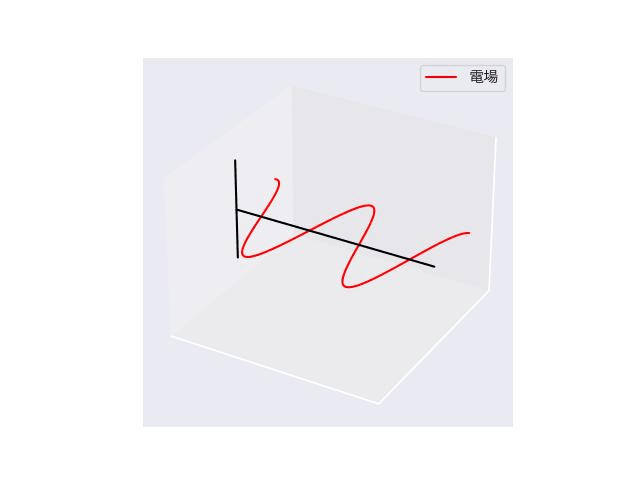
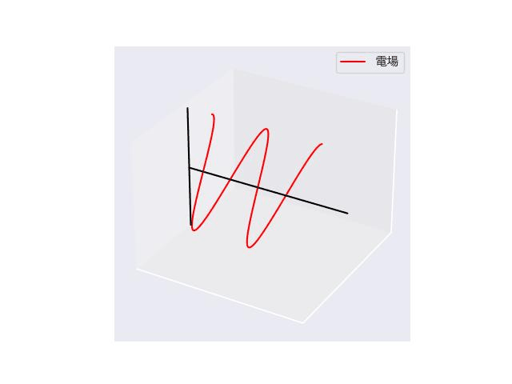
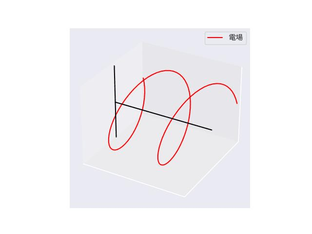
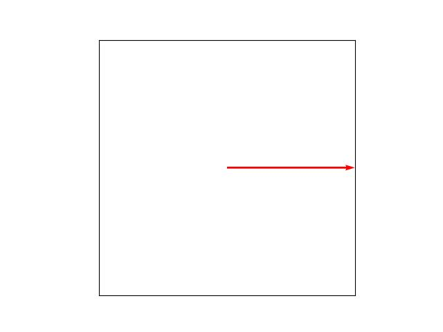
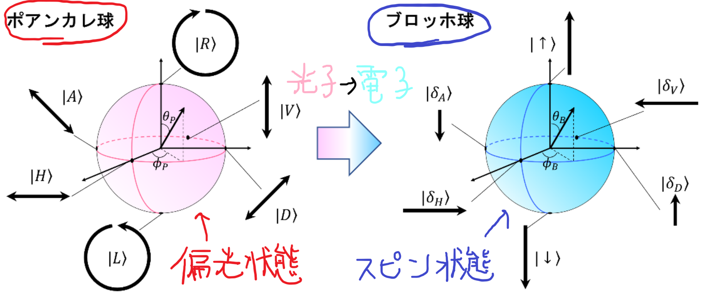
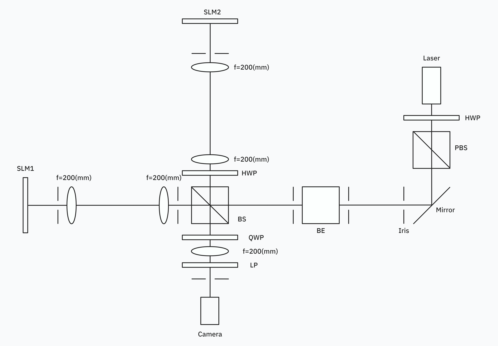
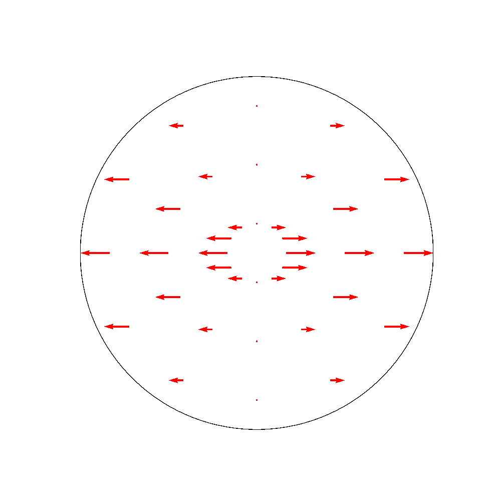

- [メモ](#メモ)
- [ジョーンズベクトル](#ジョーンズベクトル)
  - [直線偏光](#直線偏光)
  - [円偏光](#円偏光)
- [ジョーンズ行列](#ジョーンズ行列)
  - [1/2波長板](#12波長板)
  - [1/4波長板](#14波長板)
- [ポアンカレ球](#ポアンカレ球)
  - [射影演算子](#射影演算子)
  - [パウリ行列展開](#パウリ行列展開)
  - [ポアンカレ球](#ポアンカレ球-1)
  - [パウリ行列と物理量](#パウリ行列と物理量)
  - [SLM](#slm)
  - [高次元ポアンカレ球](#高次元ポアンカレ球)
- [ブロッホ球](#ブロッホ球)
  - [高次元ブロッホ球](#高次元ブロッホ球)
- [近軸近似のもとでスカラー場に対するヘルムホルツ方程式を解く](#近軸近似のもとでスカラー場に対するヘルムホルツ方程式を解く)
  - [ヘルムホルツ方程式の導出](#ヘルムホルツ方程式の導出)
- [近軸近似のもとでベクトル場に対するヘルムホルツ方程式を解く](#近軸近似のもとでベクトル場に対するヘルムホルツ方程式を解く)
  - [エルミート多項式](#エルミート多項式)
  - [ラプラシアンを考える](#ラプラシアンを考える)
- [近軸近似せずにスカラー場のヘルムホルツ方程式を解く](#近軸近似せずにスカラー場のヘルムホルツ方程式を解く)
- [Gouy位相とは](#gouy位相とは)
- [Vector Beamの評価方法](#vector-beamの評価方法)
- [Vector Beamと機械学習](#vector-beamと機械学習)
  - [物理のための機械学習講義(Youtube)](#物理のための機械学習講義youtube)
- [実験案](#実験案)
  - [その１(未完成)](#その１未完成)
  - [その２(未完成)](#その２未完成)
  - [その３(未完成)](#その３未完成)
  - [その4](#その4)
  - [その5](#その5)
- [論文](#論文)
  - [SLM2個使ってベクトルビームを作る](#slm2個使ってベクトルビームを作る)
    - ["Polarization distribution control of parallel femtosecond pulses with spatial light modulators"](#polarization-distribution-control-of-parallel-femtosecond-pulses-with-spatial-light-modulators)
    - ["Holographic femtosecond laser manipulation for advanced material processing"](#holographic-femtosecond-laser-manipulation-for-advanced-material-processing)
    - ["Flexible generation of the generalized vector vortex beams"(2021)](#flexible-generation-of-the-generalized-vector-vortex-beams2021)
  - [ベクトルビームと機械学習](#ベクトルビームと機械学習)
    - ["Machine learning-based classification of vector vortex beams"](#machine-learning-based-classification-of-vector-vortex-beams)
  - [ベクトルビームと幾何学](#ベクトルビームと幾何学)
    - ["Observation of optical polarization Möbius strips"](#observation-of-optical-polarization-möbius-strips)
    - ["Full Poincare´ beams"](#full-poincare-beams)
    - ["Generation of A Space-Variant Vector Beam with Catenary-Shaped Polarization States"](#generation-of-a-space-variant-vector-beam-with-catenary-shaped-polarization-states)
  - [Gouy位相](#gouy位相)
    - [パンチャラトナムベリー位相](#パンチャラトナムベリー位相)
    - ["光学におけるベリー位相"](#光学におけるベリー位相)
    - ["Manifestation of the Gouy phase in strongly focused, radially polarized beams"](#manifestation-of-the-gouy-phase-in-strongly-focused-radially-polarized-beams)
  - [高次元ポアンカレ球](#高次元ポアンカレ球-1)
    - ["Higher-Order Poincaré Sphere, Stokes Parameters, and the Angular Momentum of Light"](#higher-order-poincaré-sphere-stokes-parameters-and-the-angular-momentum-of-light)
    - ["Generalized Poincare sphere"](#generalized-poincare-sphere)
  - [ベクトルビームの評価方法](#ベクトルビームの評価方法)
    - ["Measuring the nonseparability of vector vortex beams"](#measuring-the-nonseparability-of-vector-vortex-beams)
    - ["Beam quality measure for vector beams"](#beam-quality-measure-for-vector-beams)
    - ["ENTANGLEMENT OF FORMATION AND CONCURRENCE"](#entanglement-of-formation-and-concurrence)
  - [近軸近似のもとでスカラー場に対するヘルムホルツ方程式を解く](#近軸近似のもとでスカラー場に対するヘルムホルツ方程式を解く-1)
    - ["From Maxwell to paraxial wave optics"](#from-maxwell-to-paraxial-wave-optics)
    - ["Gaussian Beam 計算メモ"](#gaussian-beam-計算メモ)
    - [http://solidstatephysics.blog.fc2.com/blog-entry-47.html](#httpsolidstatephysicsblogfc2comblog-entry-47html)
  - [近軸近似のもとでベクトル場に対するヘルムホルツ方程式を解く](#近軸近似のもとでベクトル場に対するヘルムホルツ方程式を解く-1)
    - [参考:"Separability and Applications"](#参考separability-and-applications)
    - ["Vector-beam solutions of Maxwell's wave equation"](#vector-beam-solutions-of-maxwells-wave-equation)
    - ["Vector Helmholtz–Gauss and vector Laplace–Gauss beams"](#vector-helmholtzgauss-and-vector-laplacegauss-beams)
    - [http://solidstatephysics.blog.fc2.com/blog-entry-31.html](#httpsolidstatephysicsblogfc2comblog-entry-31html)
    - ["腰も砕けよ 膝も折れよ"https://decafish.blog.ss-blog.jp/archive/c2305062484-1](#腰も砕けよ-膝も折れよhttpsdecafishblogss-blogjparchivec2305062484-1)
  - [近軸近似せずにスカラー場のヘルムホルツ方程式を解く](#近軸近似せずにスカラー場のヘルムホルツ方程式を解く-1)
    - ["Nonparaxial Propagation Properties of Specially Correlated Radially Polarized Beams in Free Space"](#nonparaxial-propagation-properties-of-specially-correlated-radially-polarized-beams-in-free-space)
    - ["Closed-form bases for the description of monochromatic, strongly focused, electromagnetic fields"](#closed-form-bases-for-the-description-of-monochromatic-strongly-focused-electromagnetic-fields)
    - ["Measuring the nonseparability of vector vortex beams"](#measuring-the-nonseparability-of-vector-vortex-beams-1)
  - [ビームの最適化](#ビームの最適化)
    - ["A practical algorithm for the determination of phase from image and diffraction plane pictures"](#a-practical-algorithm-for-the-determination-of-phase-from-image-and-diffraction-plane-pictures)
    - ["Kinoform design with an optimal-rotation-angle method"](#kinoform-design-with-an-optimal-rotation-angle-method)
    - ["New iterative algorithm for the design of phaseonly gratings"](#new-iterative-algorithm-for-the-design-of-phaseonly-gratings)
    - ["Continuous-relief diffractive optical elements for two-dimensional array generation"](#continuous-relief-diffractive-optical-elements-for-two-dimensional-array-generation)
- [教科書的な立ち位置](#教科書的な立ち位置)
  - [ベクトルビーム](#ベクトルビーム)
    - ["Cylindrical vector beams: from mathematical concepts to applications"](#cylindrical-vector-beams-from-mathematical-concepts-to-applications)
    - ["Vector Beams for Fundamental Physics and Applications"](#vector-beams-for-fundamental-physics-and-applications)
  - [光渦](#光渦)
    - ["Orbital angular momentum: origins, behavior and applications"](#orbital-angular-momentum-origins-behavior-and-applications)
  - [SLM](#slm-1)
    - ["Creation and detection of optical modes with spatial light modulators"](#creation-and-detection-of-optical-modes-with-spatial-light-modulators)

# メモ
・ベクトルビームをスカラービームを空間的に配置したものだと考えると、それぞれのスカラービームは各素子を行列で表したものでベクトルを変換させたものであり、つまりポアンカレ球上で長さを変えずに表面を移動する変化（等長写像）が各ピクセルで起こっていると考えるとそれにあった機械学習の手法がありそう
・球面の１点から別の１点に移動する方法はいっぱいあるからそれが基底の取り方が無数にあることに対応している？

# ジョーンズベクトル

光というのは電場と磁場が

のように進んでいく。

振幅や波長はなじみ深いと思うがここでは光の**偏光**という特徴について見ていく。

電場だけに着目すると

のように水平に振動するものや

のように $\frac{\pi}{4}$ 傾いて振動するものなどがある。

この電場を $x$ 軸(水平方向), $y$ 軸(垂直方向)に分けて考える。

ベクトルで表すと

$$
\boldsymbol{E} = 
\begin{bmatrix}
E_{x0} e^{i\varphi_x} \\
E_{y0} e^{i\varphi_y}
\end{bmatrix}
$$

となる。

これは1941年にアメリカの物理学者ジョーンズ(R. Clark Jones)によって考案されたもので**ジョーンズベクトル**と言う。

偏光状態を**複素ベクトル**によって表すことができる。

それぞれの振幅や位相の違いによって色々な偏光状態が表される。

**※全体にかかる振幅の大きさや位相は偏光の状態に影響しないことに注意**

これは

- 全体にかかる振幅とは、例えば水平方向に振動している電場の振動の幅が変わるだけで水平であるという形は変わらない。
- 全体にかかる位相とは、例えば水平方向に振動している電場をどの位置から観測するのか(右に一番振れているところから観測するのか、
- 原点から観測するのか)の違いであり物理的にはどちらも同じ電場を表している。

ということに対応している。

## 直線偏光
例えばそれぞれの成分の振幅と位相が共に等しいとき

つまり

$$
\varphi_y = \varphi_x
$$

$$
E_{y0} = E_{x0}
$$

のとき

$$
\boldsymbol{E} = E_{x0} e^{i \varphi_x}
\begin{bmatrix}
1 \\
1
\end{bmatrix}
$$

となり、これは反時計回りに $\frac{\pi}{4}$ だけ傾いた直線偏光を表している。

確かにベクトルの成分だけで見ると $\frac{\pi}{4}$ だけ傾いたベクトルだからそう思えるかもしれないが複素数が係数としてかかっているからなんか腑に落ちない

と思う。

そこで実部を取ってみると

$$
Re(\boldsymbol{E}) = E_{x0} \cos{\varphi_x}
\begin{bmatrix}
1 \\
1
\end{bmatrix}
$$

となりこのベクトルの先端の軌跡を考えると、晴れて実平面で $\frac{\pi}{4}$ だけ傾いた直線偏光が表された。

そもそも波を複素数で表現するのは実部だけ( $\cos$ だけ)で考えると計算が面倒になるという問題を解決するためだったので最終的には実部を取るというのは理にかなっている。
 

## 円偏光

次に振幅が等しく$x$ 成分が $y$ 成分より $\frac{\pi}{2}$ だけ進んでいる場合を考える。(例えば $x$ 成分が $\cos{\varphi_x}$ なら $y$ 成分は $\cos{(\varphi_x-\frac{\pi}{2})}=\sin{\varphi_x}$ のように波が $y$ 成分の方が $z$ 軸性の方向にずれている)

$$
\begin{aligned}
\varphi_y &= \varphi_x - \frac{\pi}{2} \\
\varphi_y - \varphi_x &= -\frac{\pi}{2}\\
\therefore \delta &= -\frac{\pi}{2}
\end{aligned}
$$

※位相差を $\delta$ とした。

を(1)に代入すると

$$
\begin{aligned}
\boldsymbol{E} &= E_{x0}
\begin{bmatrix}
e^{i \varphi_x} \\
e^{i (\varphi_x - \frac{\pi}{2})}
\end{bmatrix} \\
&= E_{x0} e^{i\varphi_x}
\begin{bmatrix}
1 \\
e^{-i\pi}
\end{bmatrix} \\
&= E_{x0} e^{i\varphi_x}
\begin{bmatrix}
1 \\
-i
\end{bmatrix} \\
\end{aligned}
$$

これは**左回り円偏光**を表している。

なぜなら、これも実部をとると

$$
Re(\boldsymbol{E}) = \frac{1}{\sqrt{2}}
\begin{bmatrix}
\cos{\varphi_x} \\
\sin{\varphi_x}
\end{bmatrix}
$$

 

となるがこれは $\varphi_x$ を変化させていくと $x-y$ 平面で左回りに回転するベクトル場になる。

【補足】
上ではこのジョーンズベクトルは左回り円偏光を表しているといったが、右回り円偏光を表していると書いてある教科書もあるこれは***座標系をどこから見るかによって起こる問題である。***

座標は右手系が基本なのでz軸が紙面裏面から紙面表面に向かうようにとると、水平方向はx軸に、垂直方向はy軸になる。つまり、 $z$ 軸正の方向から見るのか、負の方向から見るのかで回り方が逆転する。

***なんでx,yが反転するような立場から考えるの？***
と思うかもしれないがこれは工学系と理学系で光のとらえ方が異なるかららしい。

つまり**工学寄りの光学**の分野ではあくまで**主役は光であり**光を迎える視点で考えたいのだと思う。

逆に**理学寄りの光学**では**主役は光によって照らされるサンプル**であるので光を送り出す立場で現象を考える。
 

同様に $y$ 成分が $x$ 成分より $\frac{\pi}{2}$ だけ遅れている場合を考えると

$$
\boldsymbol{E} = E_{x0} e^{i\varphi_x}
\begin{bmatrix}
1 \\
i
\end{bmatrix}
$$

これは右回り円偏光を表している。

なぜなら、これも実部をとると

$$
Re(\boldsymbol{E}) = E_{x0}
\begin{bmatrix}
\cos{\varphi_x} \\
-\sin{\varphi_x}
\end{bmatrix}
$$

となり、先ほどとは逆に左回り円偏光になる。

これは

のように電場が変化しているということで

$z$軸正の方向から見ると電場が

のように変化する。

まとめると

**電場の振動方向はジョーンズベクトルという複素ベクトルで表現することができ、偏光状態を変えるということはジョーンズベクトルを変えるということである。**

【補足】

ここで左右円偏光を表す2つのベクトルの内積をとってみると

$$
E_{x0}^2 e^{2i\varphi_x}
\begin{aligned}
\begin{bmatrix}
1 & -i
\end{bmatrix}
^*
\begin{bmatrix}
1  \\
i
\end{bmatrix}
\end{aligned}
= 0
$$

となり直交していることが分かる。

実は任意の偏光状態は左右円偏光の重ね合わせで表すことができる。

それだけでなく、基底の取り方は無数にある。

後の項でこれは詳しく説明する。
 

# ジョーンズ行列

偏光状態を変えるということはジョーンズベクトルを異なるジョーンズベクトルに変換することだと言った。

変換させる方法として**波長板**と呼ばれているものを使う。

$2$成分ベクトルを変換させるということはこの波長板という素子は $2 \times 2$ の行列とみなせそうだと思える。

実際に行列で表現でき、この行列を**ジョーンズ行列**という。

波長板は遅相子(retardar)と呼ばれ、2つの直交する電場の一方の位相を変化させる。

どちらの位相を遅らせるかで2通りの種類があるがここでは

$y$ 成分の位相が進むように($x$成分の位相が遅れるように)方向を選ぶ。(yを進相軸に選ぶ。)

それぞれの位相を独立に変化させるので行列の非対角成分は0になると予想できる。

確かに波長板は

$$
\begin{aligned}
J &=
\begin{bmatrix}
e^{i\varphi_x} & 0 \\
0 & e^{i\varphi_y}
\end{bmatrix} \\
&= e^{i\varphi_x}
\begin{bmatrix}
1 & 0 \\
0 & e^{i(\varphi_y - \varphi_x)}
\end{bmatrix} \\
&= e^{i\varphi_x}
\begin{bmatrix}
1 & 0 \\
0 & e^{i\delta}
\end{bmatrix} \\ 
\end{aligned}
$$

となる。(例によって位相差を $\delta$ とした。)

偏光素子では位相差をどのくらい与えるのだけが重要なのであると述べたのでこれを

$$
J =
\begin{bmatrix}
1 & 0 \\
0 & e^{i\delta}
\end{bmatrix}
$$

とする。

ここでこの行列の転置をとって複素共役をとったものと元の行列を掛けてみると、これは単位行列になる。

つまり偏光素子を行列で表したものは**ユニタリー行列**であることが分かる。

また、偏光子は $x-y$ 平面でどのくらい傾けるかという自由度があり, $\theta$ だけ回転させるとジョーンズ行列は

$$
\begin{aligned}
J &=
\begin{bmatrix}
\cos{\theta} & -\sin{\theta} \\
\sin{\theta} & \cos{\theta}
\end{bmatrix}
\begin{bmatrix}
1 & 0 \\
0 & e^{i\delta}
\end{bmatrix}
\begin{bmatrix}
\cos{\theta} & \sin{\theta} \\
-\sin{\theta} & \cos{\theta}
\end{bmatrix} \\
&= 
\begin{bmatrix}
\cos{\theta} & -e^{i\delta} \sin{\theta} \\
\sin{\theta} & e^{i\delta} \cos{\theta}
\end{bmatrix}
\begin{bmatrix}
\cos{\theta} & \sin{\theta} \\
-\sin{\theta} & \cos{\theta}
\end{bmatrix} \\
\therefore J &= 
\begin{bmatrix}
e^{i\delta} \sin^2{\theta} + \cos^2{\theta} & \sin{\theta} \cos{\theta} (1 - e^{i\delta}) \\
\sin{\theta} \cos{\theta} (1 - e^{i\delta}) & \sin^2{\theta} + e^{i\delta} \cos^2{\theta}
\end{bmatrix} \\ 
\end{aligned}
$$

となる。

次の項では位相差をどのくらい与えるかを考える
## 1/2波長板

位相差を $\delta=\pi$ 与えるものを **1/2波長板(HWP:Half Wave Plate)** という。

前項で導出した式に代入してみると

$$
\begin{aligned}
J_{HWP(\theta)} &=
\begin{bmatrix}
-\sin^2{\theta} + \cos^2{\theta} & 2\sin{\theta} \cos{\theta} \\
2\sin{\theta} \cos{\theta} & \sin^2{\theta} - \cos^2{\theta}
\end{bmatrix} \\
&= 
\begin{bmatrix}
\cos{2\theta} & \sin{2\theta} \\
\sin{2\theta} & -\cos{2\theta}
\end{bmatrix}
\end{aligned}
$$

を得る。

特に $\theta = 0$ のときは

$$
J_{HPW(\theta=0)} =
\begin{bmatrix}
1 & 0 \\
0 & -1
\end{bmatrix}
$$

というジョーンズ行列を得る。

ここに $\frac{\pi}{4}$ だけ傾いた直線偏光

$$
\boldsymbol{E}_{in} = 
\begin{bmatrix}
1 \\
1
\end{bmatrix}
$$

を入射させると

$$
\boldsymbol{E}_{out} = 
\begin{bmatrix}
1 \\
-1
\end{bmatrix}
$$

となり, $-\frac{\pi}{4}$ だけ傾いた直線偏光を表していている。

元の状態から時計回りに $2 \times \frac{\pi}{4}$ だけ回転している。

となる。

また、 $\theta = \frac{\pi}{4}$ だけ回転させると

$$
J_{HWP(\theta=\frac{\pi}{4})} =
\begin{bmatrix}
0 & 1 \\
1 & 0
\end{bmatrix}
$$

となり **x,y成分を交換する** という働きをする。

## 1/4波長板
位相差 $\delta=\frac{\pi}{2}$ であるので

$$
\begin{aligned}
J_{QWP(\theta)} &=
\begin{bmatrix}
e^{i \frac{\pi}{2}} \sin^2{\theta} + \cos^2{\theta} & \sin{\theta} \cos{\theta} (1 - e^{i \frac{\pi}{2}}) \\
\sin{\theta} \cos{\theta} (1 - e^{i \frac{\pi}{2}}) & \sin^2{\theta} + e^{i \frac{\pi}{2}} \cos^2{\theta}
\end{bmatrix} \\
&=
\begin{bmatrix}
i \sin^2{\theta} + \cos^2{\theta} & \sin{\theta} \cos{\theta} (1 - i) \\
\sin{\theta} \cos{\theta} (1 - i) & \sin^2{\theta} + i \cos^2{\theta}
\end{bmatrix} \\
&=
\begin{bmatrix}
1 - i\cos{2\theta} & -i\sin{2\theta}\\
-i\sin{2\theta} & 1 + i\cos{2\theta}
\end{bmatrix}
\end{aligned}
$$

を得る。

 $\theta = 0$ のときは

$$
J_{QWP(\theta=0)} =
\begin{bmatrix}
1 & 0 \\
0 & i
\end{bmatrix}
$$

となる。

$\frac{\pi}{4}$ だけ傾いた直線偏光

$$
\boldsymbol{E}_{in} = 
\begin{bmatrix}
1 \\
1
\end{bmatrix}
$$

を入射させると

$$
\boldsymbol{E}_{out} = 
\begin{bmatrix}
1 \\
i
\end{bmatrix}
$$

となりこれは右回り円偏光を表している。

# ポアンカレ球

ジョーンズベクトルを

$$
\begin{bmatrix}
\alpha \\
\beta 
\end{bmatrix}
(\alpha, \beta \in C)
$$

と表したときストークスパラメーターという実数値は

$$
\begin{bmatrix}
S1 \\
S2 \\
S3
\end{bmatrix} =
\begin{bmatrix}
|\alpha|^2 - |\beta|^2 \\
2 Re(\alpha \beta) \\
-2 Im(\alpha \beta)
\end{bmatrix}
$$

多くの光学の教科書ではストークスパラメータは以上のように定義されたものとして紹介される。

そこでこれを導出する。

## 射影演算子
今までジョーンズベクトルの各成分の振幅比と位相差のみが重要と言ってきたので

$$
| \alpha | ^2 + | \beta | ^2 = 1
$$

としても任意の振幅比も表現できる。

ここで天下り的だが以下のようにジョーンズベクトルから行列を作る。

$$
P = 
\begin{bmatrix}
\alpha \\
\beta 
\end{bmatrix}
\begin{bmatrix}
\alpha
\beta 
\end{bmatrix} ^*
$$

これは**射影演算子**と呼ばれる。

ただしどんな行列も射影演算子となるわけではなく以下の2つを満たす必要がある。(線形写像となる条件？)

$$
\begin{aligned}
・
P^2 &= 1 \\
・
P^ \dagger &= P
\end{aligned}
$$

計算してみると、確かに

$$
\begin{aligned}
P^2 &= (
\begin{bmatrix}
\alpha \\
\beta 
\end{bmatrix} 
\begin{bmatrix}
\alpha
\beta 
\end{bmatrix} ^* ) (
\begin{bmatrix}
\alpha \\
\beta 
\end{bmatrix}
\begin{bmatrix}
\alpha
\beta 
\end{bmatrix} ^* ) \\
&= 
\begin{bmatrix}
\alpha \\
\beta 
\end{bmatrix} (
\begin{bmatrix}
\alpha
\beta 
\end{bmatrix} ^*  
\begin{bmatrix}
\alpha \\
\beta 
\end{bmatrix} )
\begin{bmatrix}
\alpha
\beta 
\end{bmatrix} ^*
\\
&= 
\begin{bmatrix}
\alpha \\
\beta 
\end{bmatrix} (
| \alpha | ^2 + | \beta | ^2 )
\begin{bmatrix}
\alpha
\beta 
\end{bmatrix} ^* \\
\therefore P^2 &= P
\end{aligned}
$$

次に

$$
\begin{aligned}
P ^{\dagger}
&=
(
\begin{bmatrix}
\alpha \\
\beta 
\end{bmatrix}
\begin{bmatrix}
\alpha
\beta 
\end{bmatrix}
^* ) ^{\dagger} \\
&=
(
\begin{bmatrix}
\alpha \\
\beta 
\end{bmatrix}
\begin{bmatrix}
\alpha
\beta 
\end{bmatrix}
^* ) ^{\dagger} \\
&=
(
\begin{bmatrix}
\alpha \\
\beta 
\end{bmatrix}
^* )^*
\begin{bmatrix}
\alpha
\beta 
\end{bmatrix}
^* \\
\therefore P^{\dagger} 
&=
P
\end{aligned}
$$

## パウリ行列展開
https://electrodynamics.hatenablog.com/entry/2018/12/01/233744
https://electrodynamics.hatenablog.com/entry/2018/12/16/000833

パウリ行列は

$$
\sigma_0 =
\begin{bmatrix}
1 & 0 \\
0 & 1
\end{bmatrix}, \quad
\sigma_1 =
\begin{bmatrix}
1 & 0 \\
0 & -1
\end{bmatrix}, \quad
\sigma_2 =
\begin{bmatrix}
0 & 1 \\
1 & 0
\end{bmatrix}, \quad
\sigma_3 =
\begin{bmatrix}
0 & -i \\
i & 0
\end{bmatrix}
$$

で表される。

さきほどのジョーンズベクトルから作った行列をパウリ行列の和で表すことを考える。

ここでパウリ行列の性質として、例えば

$$
\begin{aligned}
\sigma_2 ^2 &=
\begin{bmatrix}
0 & 1 \\
1 & 0
\end{bmatrix}
\begin{bmatrix}
0 & 1 \\
1 & 0
\end{bmatrix} \\
&= 
\begin{bmatrix}
1 & 0 \\
0 & 1
\end{bmatrix}
\end{aligned}
$$

となり2乗すると単位行列であり、

異なる行列同士の積のTrを考えると、例えば

$$
\begin{aligned}
Tr( \sigma_3 \sigma_2 ) &= Tr \Bigl (
\begin{bmatrix}
0 & -i \\
i & 0
\end{bmatrix}
\begin{bmatrix}
0 & 1 \\
1 & 0
\end{bmatrix} \Bigr )\\
&= Tr \Bigl (
\begin{bmatrix}
-i & 0 \\
0 & i
\end{bmatrix} \Bigr ) \\
&= 
-i + i \\
\therefore Tr( \sigma_3 \sigma_2 ) 
&=
0
\end{aligned}
$$

となり0となる。

これら2つの性質を使うと、以下のようにパウリ行列の和で表したとき、

$$
\begin{aligned}
P &= \frac{1}{2} (
h_0 \sigma_0 + h_1
\sigma_1 + h_2 \sigma_2 + h_3 \sigma_3 ) \\
&= \frac {1} {2} \Bigl (
h_0 
\begin{bmatrix}
1 & 0 \\
0 & 1
\end{bmatrix}
+h_1
\begin{bmatrix}
1 & 0 \\
0 & -1
\end{bmatrix}
+h_2
\begin{bmatrix}
0 & 1 \\
1 & 0
\end{bmatrix}
+h_3
\begin{bmatrix}
0 & -i \\
i & 0 
\end{bmatrix} 
\Bigr )
\end{aligned}
$$

と仮定すると

先ほどの積の性質を使えば、例えば

$$
\begin{aligned}
\mathrm{Tr}(P \sigma _ 3) &= \frac{1}{2} \Bigl(h_0 \mathrm{Tr}(\sigma _ 0 \sigma _ 3) + h _ 1 \mathrm{Tr}(\sigma _ 1 \sigma _ 3) + h _ 2 \mathrm{Tr}(\sigma _ 2 \sigma _ 3) + h _ 3 \mathrm{Tr}(\sigma _ 3 \sigma _ 3) \Bigr) \\
&=
h_3 \newline
&=
2 \mathrm{Tr} \Bigl(
\begin{bmatrix}
\mid \alpha \mid ^2 & \alpha \beta ^ \ast \newline
\alpha  \ast* \beta & \mid \beta \mid ^2
\end{bmatrix}
\begin{bmatrix}
0 & -i \\ i & 0
\end{bmatrix}
\Bigr) \newline
&=
\mathrm{Tr} \Bigl( 
\begin{bmatrix}
i \alpha \beta^* & -i \mid \alpha \mid ^2 \newline
i \mid \beta \mid ^2 & -i \alpha ^\ast \beta
\end{bmatrix}
\Bigr) \newline
&=
i (\alpha \beta ^ \ast - \alpha ^ \ast \beta) \newline
&=
-2 \mathrm{Im}(\alpha \beta ^ \ast) \newline
\therefore h_3
&=
-2 \mathrm{Im}(\alpha \beta ^ \ast)
\end{aligned}
$$

のように係数が求められる。

他も同じように計算すると結局

$$
\begin{aligned}
P
&=
\frac{1}{2} (
h _ 0 \sigma _ 0 + h _ 1 \sigma _ 1 + h _ 2 \sigma _ 2 + h _ 3 \sigma _ 3 ) \newline
&=
\frac{1}{2} \Bigl (
h_0 
\begin{bmatrix}
1 & 0 \newline
0 & 1
\end{bmatrix}
+h_1
\begin{bmatrix}
1 & 0 \newline
0 & -1
\end{bmatrix}
+h_2
\begin{bmatrix}
0 & 1 \newline
1 & 0
\end{bmatrix}
+h_3
\begin{bmatrix}
0 & -i \newline
i & 0 
\end{bmatrix}
\Bigr ) \newline
&=
\frac{1}{2} \Bigl (
\bigl (\mid \alpha \mid ^2 + \mid \beta \mid ^2 \bigr )
\begin{bmatrix}
1 & 0 \newline
0 & 1
\end{bmatrix}
+\bigl (\mid \alpha \mid ^2 - \mid \beta \mid ^2 \bigr )
\begin{bmatrix}
1 & 0 \newline
0 & -1
\end{bmatrix}
+2 Re( \alpha \beta ^ \ast)
\begin{bmatrix}
0 & 1 \newline
1 & 0
\end{bmatrix}
-2 Im( \alpha \beta ^ \ast)
\begin{bmatrix}
0 & -i \newline
i & 0 
\end{bmatrix}
\Bigr )
\end{aligned}
$$

今は $|\alpha| ^2 + |\beta| ^2 = 1$ を考えているので第一項目の係数は1になるため、以下では $h_1, h_2, h_3$ のみを考える。

この係数をベクトルとしたもの

$$
\begin{aligned}
\boldsymbol{ S }
&= 
\begin{bmatrix}
S _ 1 \newline
S _ 2 \newline
S _ 3
\end{bmatrix}
\newline
&=
\begin{bmatrix}
h _ 1 \newline
h _ 2 \newline
h _ 3
\end{bmatrix}
\newline
\therefore \boldsymbol{S}
&= 
\begin{bmatrix}
\mid \alpha \mid ^2 - \mid \beta \mid ^2 \newline
2 Re( \alpha \beta ^ \ast) \newline
-2 Im( \alpha \beta ^ \ast)
\end{bmatrix}
\end{aligned}
$$

となりストークスベクトルを導出できた。

## ポアンカレ球

実は計算すると分かるが先ほど導出したストークスパラメーターは

$$
S^2 _ 1 + S^2 _ 2 + S^2 _ 3 = 1
$$

の関係がある。

これはストークスベクトルが

 $S_1, S_2, S_3$ **を軸とした単位球面上の1点を指している。**

ということを表している。

また、これまで波長板について話してきたが、

**波長板によって光の偏光分布が変わるということはジョーンズベクトルが変わる、つまりストークスベクトルが変わる、つまりポアンカレ球面上で別の座標に移る。**

ということを意味している。

**波長板によってポアンカレ球上の座標がくるくると移動するということ。**

※このように長さを変えない(今は球の表面上で移動する)写像を等長写像という。

水平偏光が $(S_1, S_2, S_3) = (1, 0, 0)$

右回り円偏光が $(S_1, S_2, S_3) = (0, 0, 1)$

など。

## パウリ行列と物理量

パウリ行列はそれぞれどの軸のスピンをもっているかをあらわす物理量を観測できる。

例えば

$$
\begin{aligned}
S_1 &=
\begin{bmatrix}
\alpha ^* \: \beta ^*
\end{bmatrix}
\begin{bmatrix}
1 & 0 \\
0 & -1
\end{bmatrix}
\begin{bmatrix}
\alpha \\
\beta
\end{bmatrix} \\ 
&=
\begin{bmatrix}
\alpha ^* \: \beta
\end{bmatrix}
\begin{bmatrix}
\alpha \\
-\beta
\end{bmatrix} \\
\therefore S_1
&=  
| \alpha | ^2 - | \beta | ^2
\end{aligned}
$$

$$
\begin{aligned}
S_2 &=
\begin{bmatrix}
\alpha ^* \: \beta ^*
\end{bmatrix}
\begin{bmatrix}
0 & 1 \\
1 & 0
\end{bmatrix}
\begin{bmatrix}
\alpha \\
\beta
\end{bmatrix} \\ 
&=
\begin{bmatrix}
\alpha ^* \: \beta
\end{bmatrix}
\begin{bmatrix}
\beta \\
\alpha
\end{bmatrix} \\
&= \alpha ^* \beta + \alpha \beta ^* \\
\therefore S_2
&=  
2Re(\alpha \beta ^*)
\end{aligned}
$$

$$
\begin{aligned}
S_3 &=
\begin{bmatrix}
\alpha ^* \: \beta ^*
\end{bmatrix}
\begin{bmatrix}
0 & -i \\
i & 0
\end{bmatrix}
\begin{bmatrix}
\alpha \\
\beta
\end{bmatrix} \\ 
&=
\begin{bmatrix}
\alpha ^* \: \beta
\end{bmatrix}
\begin{bmatrix}
-i \beta \\
i \alpha
\end{bmatrix} \\
&= 
-i \alpha ^* \beta + i \alpha \beta ^* \\
&=
i (\alpha \beta ^* - \alpha ^* \beta) \\
\therefore S_3 &= -2Im(\alpha \beta ^*)
\end{aligned}
$$

右回り円偏光のストークスパラメーターを計算してみる。
規格化されたジョーンズベクトルは

$$
\frac{1}{\sqrt{2}}
\begin{bmatrix}
1 \\
i
\end{bmatrix}
$$

であったので

$\alpha = \frac{1}{\sqrt{2}}, \beta = \frac{i}{\sqrt{2}}$

を代入すると

$$
\begin{aligned}
S_1 &=
\Bigl |\frac {1}{\sqrt{2}} \Bigr | ^2 - \Bigl |\frac {i}{\sqrt{2}} \Bigr | ^2 \\
&=
\frac {1}{2} - \frac {1}{2} \\
&=
0 
\end{aligned}
$$

$$
\begin{aligned}
S_2 &= 2Re\Bigl (\frac {1}{\sqrt{2}} \times \frac {i^*}{\sqrt{2}} \Bigr ) \\
&=
2Re(-i) \\
&=
0
\end{aligned}
$$

$$
\begin{aligned}
S_3
&=
-2Im\Bigl (\frac {1}{\sqrt{2}} \times \frac {i ^*}{\sqrt{2}}\Bigr ) \\ 
&=
-2Im \Bigl (- \frac {i}{2} \Bigr ) \\ 
&=
1
\end{aligned}
$$

よって

$$
S = 
(S_1, S_2, S_3) = (0, 0, 1)
$$

となる。

実は偏光と電子のスピンは密接な関係があり、電子のポアンカレ球に相当するものをブロッホ球という。

具体的には

のように対応している。

実際に論文として出されていて

.png>)

これは半導体に右回り円偏光を当てた時、上向きのスピン(赤いやつ)が励起されている様子を表している。

## SLM
$$
J_{SLM} = A_0
\begin{bmatrix}
e^{i\delta} & 0 \\
0 & 1
\end{bmatrix}
$$

ここで
- $\delta = 2[n_e(V)-n_o]kd$
- $A_0 = e^{i2n_okd}$
- $k = \frac{2\pi}{\lambda}$
- $n_o:$光軸に垂直な面の屈折率
- $n_e:$光軸に平行な面の屈折率でこれは電圧によって制御できる

ジョーンズベクトルでこの変換の過程を表す。
⓵レーザー光がHWP,PBSによって変換される
⓶SLM1で反射してBSに戻ってくるビーム
⓷HWPを通過してSLM2で反射してHWPを通過してBSに戻ってくるビーム
⓸各SLMで反射して戻ってきたビームがBSで合わさったビーム
⓹合わさったビームがQWPで変換されたビーム

$$
\boldsymbol {E} _ {out} = J_{QWP(\gamma)} [J_{SLM1} + J_{HWP(-\beta)} J_{SLM2} J_{HWP(\beta)}] J_{PBS} J_{HWP(\alpha)} \boldsymbol {E} _ {in}
$$

 

## 高次元ポアンカレ球

# ブロッホ球
## 高次元ブロッホ球

# 近軸近似のもとでスカラー場に対するヘルムホルツ方程式を解く

## ヘルムホルツ方程式の導出

ファラデーの法則

$$
\nabla \times \boldsymbol {E} (\boldsymbol {r} , t) = -\frac{\partial \boldsymbol {B} (\boldsymbol {r} , t) } {\partial t}
$$

に対して両辺の回転を取ると

$$
\nabla \times (\nabla \times \boldsymbol {E} (\boldsymbol {r} , t) ) = - \mu_0 \nabla \times \frac{\partial \boldsymbol {H} (\boldsymbol {r} , t) }{\partial t}
$$

となるがここでアンペールの法則

$$
\nabla \times \boldsymbol {H} (\boldsymbol {r} , t) = \epsilon_0 \frac{\partial \boldsymbol {E} (\boldsymbol {r} , t) }{\partial t}
$$

を代入すると

$$
\nabla \times (\nabla \times \boldsymbol {E} (\boldsymbol {r} , t) ) = - \epsilon_0 \mu_0 \frac{\partial^2 \boldsymbol {E} (\boldsymbol {r} , t) }{\partial t^2}
$$

を得る。ここで

$$
\nabla \times (\nabla \times \boldsymbol {E} (\boldsymbol {r} , t) ) = \nabla(\nabla \cdot \boldsymbol {E} (\boldsymbol {r} , t) ) - \nabla^2 \boldsymbol {E} (\boldsymbol {r} , t)
$$

より

$$
\nabla(\nabla \cdot \boldsymbol {E} (\boldsymbol {r} , t) ) - \nabla^2 \boldsymbol {E} (\boldsymbol {r} , t) = - \epsilon_0 \mu_0 \frac{\partial^2 \boldsymbol {E} (\boldsymbol {r} , t) }{\partial t^2}
$$

を得る。電荷がない場合を考えているので

$$
\nabla \cdot \boldsymbol {E} (\boldsymbol {r} , t) = 0
$$

より

$$
\begin{aligned}
-\nabla^2 \boldsymbol {E} (\boldsymbol {r} , t) &= -\epsilon_0 \mu_0 \frac{\partial^2 \boldsymbol {E} (\boldsymbol {r} , t) }{\partial t^2} \\
\nabla^2 \boldsymbol {E} (\boldsymbol {r} , t) &= \epsilon_0 \mu_0 \frac{\partial^2 \boldsymbol {E} (\boldsymbol {r} , t) }{\partial t^2} 
\end{aligned}
$$

$$
\therefore \nabla^2 \boldsymbol{E} (\boldsymbol {r} , t) - \epsilon_0 \mu_0 \frac{\partial^2 \boldsymbol {E} (\boldsymbol {r} , t)}{\partial t^2} = 0
$$

ここで解の形を

$$
\boldsymbol {E} (\boldsymbol {r} , t) = \boldsymbol {E} (\boldsymbol {r}) f(t)
$$

と分離できると仮定する。これを代入すると

$$
\nabla^2 \boldsymbol{E} (\boldsymbol {r} ) f(t) - \epsilon_0 \mu_0 \frac{\partial^2 \boldsymbol {E} (\boldsymbol {r} ) f(t)}{\partial t^2} = 0
$$

を得る。ここでフーリエ変換

$$
F(\omega) = \frac{1}{\sqrt{2 \pi}}\int_{- \infty}^{\infty}f(t) e^{i \omega t}dt
$$

を考えると

$$
f(t) = \frac{1}{\sqrt{2 \pi}}\int_{- \infty}^{\infty}F(\omega) e^{-i \omega t}d \omega
$$

であるので代入すると

$$
\begin{aligned}
\nabla^2 \boldsymbol{E} (\boldsymbol {r} ) \frac{1}{\sqrt{2 \pi}}\int_{- \infty}^{\infty}F(\omega) e^{-i \omega t}d \omega - \epsilon_0 \mu_0 \frac{\partial^2 \boldsymbol {E} (\boldsymbol {r} )}{\partial t^2} \frac{1}{\sqrt{2 \pi}}\int_{- \infty}^{\infty}F(\omega) e^{-i \omega t}d \omega &= 0 \\
\nabla^2 \boldsymbol{E} (\boldsymbol {r} ) \frac{1}{\sqrt{2 \pi}}\int_{- \infty}^{\infty}F(\omega) e^{-i \omega t}d \omega + \frac{\epsilon_0 \mu_0 \omega ^2}{\sqrt{2 \pi}} \boldsymbol {E} (\boldsymbol {r} ) \int_{- \infty}^{\infty}F(\omega) e^{-i \omega t}d \omega &= 0 \\
\nabla^2 \boldsymbol{E} (\boldsymbol {r} ) + \epsilon_0 \mu_0 \omega ^2 \boldsymbol{E} (\boldsymbol {r} ) &= 0 \\
\nabla^2 \boldsymbol{E} (\boldsymbol {r} ) + \frac{\omega ^2}{c^2} \boldsymbol{E} (\boldsymbol {r} ) &= 0 \\
\nabla^2 \boldsymbol{E} (\boldsymbol {r} ) + \biggl (\frac{2 \pi f}{f \lambda} \biggr ) ^2 \boldsymbol{E} (\boldsymbol {r} ) &= 0 \\
\nabla^2 \boldsymbol{E} (\boldsymbol {r} ) + \biggl (\frac{2 \pi}{\lambda} \biggr ) ^2 \boldsymbol{E} (\boldsymbol {r} ) &= 0 \\
\therefore \nabla^2 \boldsymbol{E} (\boldsymbol {r} ) + k ^2 \boldsymbol{E} (\boldsymbol {r} ) &= 0
\end{aligned}
$$

これはヘルムホルツ方程式と言うタイプの偏微分方程式。

もし電場がスカラー場(偏光分布が直線であるので厳密にはベクトル場であるが座標系を適当に選べば電場の大きさだけを考えればいい)であれば

$$
\boldsymbol{E}(\boldsymbol{r}) = u(x, y, z) e^{ikz} 
$$

のように書ける。これをヘルムホルツ方程式に代入すると

$$
\begin{aligned}
\Bigl (\frac{\partial ^2}{\partial ^2 x} + \frac{\partial ^2}{\partial ^2 y} + \frac{\partial ^2}{\partial ^2 z} \Bigr ) \bigl (u(x, y, z) e^{ikz} \bigr ) + k^2 u(x, y, z) e^{ikz} &= 0 \\
\Bigl (\frac{\partial ^2 u}{\partial ^2 x} + \frac{\partial ^2 u}{\partial ^2 y} + \frac{\partial ^2 u}{\partial ^2 z} + 2ik \frac{\partial u}{\partial z} - k^2 u + k^2 u \Bigr ) e^{ikz} &= 0 \\
\frac{\partial ^2 u}{\partial ^2 x} + \frac{\partial ^2 u}{\partial ^2 y} + \frac{\partial ^2 u}{\partial ^2 z} + 2ik \frac{\partial u}{\partial z} &= 0
\end{aligned}
$$

ここで近軸近似を考えると

$$
\frac{\partial ^2 u}{\partial ^2 x} + \frac{\partial ^2 u}{\partial ^2 y} + 2ik \frac{\partial u}{\partial z} = 0
$$

を得る。

# 近軸近似のもとでベクトル場に対するヘルムホルツ方程式を解く

## エルミート多項式

## ラプラシアンを考える

演算する関数がスカラー場の時、ラプラシアンを演算するということは

$$
\nabla ^2 f = \nabla \cdot (\nabla f)
$$

となり勾配をとった後に発散をとることに相当する。**(スカラーラプラス演算子)**

演算する関数がベクトル場の時、ラプラシアンを演算するということは

$$
\nabla ^2 \boldsymbol{f} = \nabla (\nabla \cdot \boldsymbol{f})
-\nabla \times (\nabla \times \boldsymbol{f})
$$

に相当する。**(ベクトルラプラス演算子)**

今は電荷が存在しないマクスウェル方程を考えているので右辺第1項はゼロになり

$$
\nabla \times \nabla \times \boldsymbol{E} -k^2 \boldsymbol{E} = 0
$$

となる。解の形として

$$
\boldsymbol{E}(r, z) = U(r, z) e^{ikz} \boldsymbol{e}_\phi
$$

のように軸対称な解を考える。

円筒座標系でのナブラは

$$
\nabla = \frac{\partial}{\partial r} \boldsymbol{e}_r + \frac{1}{r} \frac{\partial}{\partial \phi} + \frac{\partial}{\partial z} \boldsymbol{e}_z
$$

で
であるが今は $\phi$ が一定であるので

$$
\nabla = \frac{\partial}{\partial r} \boldsymbol{e}_r + \frac{\partial}{\partial z} \boldsymbol{e}_z
$$

となる。回転をとると

$$
\nabla \times \boldsymbol{E} = \Bigl (\frac{1}{r} \frac{\partial}{\partial \phi} E _ z - \frac{\partial}{\partial z} E_\phi \Bigr ) \boldsymbol{e} _ r + \Bigl (\frac{\partial}{\partial z} E_r - \frac{\partial}{\partial r} E _ z \Bigr ) \boldsymbol{e} _ \phi + \frac{1}{r} \Bigl (\frac{\partial}{\partial r} (r E_\phi) - \frac{\partial}{\partial \phi} E _ r \Bigr )\boldsymbol{e} _ z
$$

であるが今は

$$
E _ r = E _ z = 0
$$

より

$$
\nabla \times \boldsymbol{E} = - \frac{\partial}{\partial z} E _ \phi \boldsymbol{e} _ r + \frac{1}{r} \frac{\partial}{\partial r} (r E_\phi) \boldsymbol{e} _ z
$$

$$
\begin{aligned}
\nabla \times (\nabla \times \boldsymbol{E})
&=
\frac{1}{r} \frac{\partial}{\partial \phi} \Bigl ( \frac{1}{r} \frac{\partial}{\partial r} (r E _ \phi) \Bigr ) \boldsymbol{e}_r - \Bigl ( \frac{\partial ^2}{\partial z ^2} E _ \phi + \frac{\partial}{\partial r} \Bigl ( \frac{1}{r} \frac{\partial}{\partial r} (r E _ \phi) \Bigr ) \Bigr ) \boldsymbol{e} _ \phi \newline
&=
-\Bigl ( \frac{\partial ^2}{\partial z ^2} E _ \phi + \frac{\partial}{\partial r} \Bigl ( \frac{1}{r} \frac{\partial}{\partial r} (r E _ \phi) \Bigr ) \Bigr ) \boldsymbol{e} _ \phi \newline
&※ E _ \phi は \phi を含まないので第1項はゼロ
\end{aligned}
$$

いったん整理すると

$$
\begin{aligned}
\nabla \times \nabla \times \boldsymbol{E} -k^2 \boldsymbol{E} &= 0 \\
-\frac{\partial ^2}{\partial z ^2} E_\phi -\frac{\partial}{\partial r} \Bigl ( \frac{1}{r} \frac{\partial}{\partial r} (r E_\phi) \Bigr ) -k^2 E_\phi &= 0 \\
\end{aligned}
$$

これを計算すれば

$$
\begin{aligned}
\Bigl ( -\frac{\partial ^2 U}{\partial z ^2} -2ik \frac{\partial U}{\partial z} +k^2 U +\frac{1}{r^2} U -\frac{1}{r} \frac{\partial U}{\partial r} -\frac{\partial ^2 U}{\partial r ^2} -k^2 U \Bigr ) e^{ikz} &= 0 \\
-\frac{\partial ^2 U}{\partial z ^2} -2ik \frac{\partial U}{\partial z} +\frac{1}{r^2} U -\frac{1}{r} \frac{\partial}{\partial r} \Bigl ( r \frac{\partial U}{\partial r} \Bigl ) &= 0 \\
\therefore \quad \frac{1}{r} \frac{\partial}{\partial r} \Bigl ( r \frac{\partial U}{\partial r} \Bigl ) -\frac{1}{r^2} U +2ik \frac{\partial U}{\partial z} +\frac{\partial ^2 U}{\partial z ^2} &= 0
\end{aligned}
$$

を得る。例によって近軸近似をすると左辺第4項はゼロになるので

$$
\frac{1}{r} \frac{\partial}{\partial r} \Bigl ( r \frac{\partial U}{\partial r} \Bigl ) - \frac{1}{r^2} U + 2ik \frac{\partial U}{\partial z} = 0
$$

を得る。

# 近軸近似せずにスカラー場のヘルムホルツ方程式を解く

# Gouy位相とは

# Vector Beamの評価方法
ベクトルビームやビームの偏光分布を表現するときはビーム強度の画像に矢印を付け加える方法が主に使われる。（それぞれの矢印は偏光板を途中に入れることで任意の直線偏光の光強度を取得したものから描く。）

# Vector Beamと機械学習

## 物理のための機械学習講義(Youtube)

# 実験案
## その１(未完成)

⓵,BSに入射するビーム(HWP, PBS)
レーザーから出た光のジョーンズベクトルは

$$
\boldsymbol{E} = 
\begin{bmatrix}
E _ {x0} e^{i\varphi_x} \newline
E _ {y0} e^{i\varphi_y}
\end{bmatrix}
$$

となる。

$\alpha$ だけ傾けたHWPのジョーンズ行列は

$$
J _ {HWP(\alpha)} = 
\begin{bmatrix}
\cos{2\alpha} & \sin{2\alpha} \newline
\sin{2\alpha} & -\cos{2\alpha}
\end{bmatrix}
$$

となる。

今はPBSをP偏光を取り出すものとして使っているのでジョーンズ行列は

$$
J _ {PBS} = 
\begin{bmatrix}
1 & 0 \newline
0 & 0
\end{bmatrix}
$$

となる。これらをかければよいので

$$\begin{aligned}
\boldsymbol{E} _ {out1} &=
J_{PBS} J _ {HWP(\alpha)} \boldsymbol{E} _ {in} \newline
&= 
\begin{bmatrix}
1 & 0 \newline
0 & 0 
\end{bmatrix}
\begin{bmatrix}
\cos{2\alpha} & \sin{2\alpha} \newline
\sin{2\alpha} & -\cos{2\alpha}
\end{bmatrix}
\begin{bmatrix}
E _ {x0} e^{i\varphi_x} \newline
E _ {y0} e^{i\varphi_y}
\end{bmatrix} \newline
&=
\begin{bmatrix}
\cos{2\alpha} & \sin{2\alpha} \newline
0 & 0
\end{bmatrix}
\begin{bmatrix}
E _ {x0} e^{i\varphi_x} \newline
E _ {y0} e^{i\varphi_y}
\end{bmatrix} \newline
\therefore \boldsymbol{E} _ {out1}&=
\begin{bmatrix}
E _ {x0} e^{i\varphi_x} \cos{2\alpha} + E _ {y0} e^{i\varphi_y} \sin{2\alpha} \newline
0
\end{bmatrix}
\end{aligned}$$

つまりここではP偏光成分の大きさを決めていている。
今は偏光を考えているのでここでは便宜上

$$
\boldsymbol{E} _ {out1} =
\begin{bmatrix}
1 \newline
0
\end{bmatrix}
$$

とする。

⓶,SLM1で反射してBSに戻ってくるビーム

$$
J _ {SLM} = A_0
\begin{bmatrix}
-e^{i\delta} & 0 \newline
0 & 1
\end{bmatrix}
$$

であったが先ほどと同様に強度の情報はいらないので今は

$$
J _ {SLM1} = 
\begin{bmatrix}
-e^{i\delta _ 1} & 0 \newline
0 & 1
\end{bmatrix}
$$

$\delta _ 1 = p\varphi + \delta_{10} \quad (p \in \mathbb{Z})$

$$
J _ {SLM2} = 
\begin{bmatrix}
-e^{i\delta _ 2} & 0 \newline
0 & 1
\end{bmatrix}
$$

$\delta _ 2 = q\varphi + \delta _ {20} \quad (q \in \mathbb{Z})$

- $\varphi:$ 方位角(azimuthal angle)
- $\delta _ {10}, \delta _ {20}:$ constant phase

とする。(軸対称なベクトルビームを作りたいので変数は $\varphi$ (方位角のみ))
よってSLM1で反射してBSに戻ってくるビームは

$$
\begin{aligned}
\boldsymbol{E} _ {out2}
&=
\begin{bmatrix}
-e^{i\delta _ 1} & 0 \newline
0 & 1
\end{bmatrix}
\boldsymbol{E} _ {out1} \newline 
\boldsymbol{E} _ {out2}
&=
\begin{bmatrix}
-e^{i\delta _ 1} & 0 \newline
0 & 1
\end{bmatrix}
\begin{bmatrix}
1 \newline
0
\end{bmatrix} \newline
\therefore \boldsymbol{E} _ {out2}
&=
\begin{bmatrix}
 -e^{i\delta _ 1} \newline
0
\end{bmatrix}
\end{aligned}
$$

これも偏光だけを考えているので

$$
\boldsymbol{E} _ {out2} = 
\begin{bmatrix}
1 \newline
0
\end{bmatrix}
$$

SLM1の役割は波面変調

⓷, $\beta$ 傾けたHWPを通過してSLM2で反射して先ほどと同じHWPを通過してBSに戻ってくるビーム

$$
\begin{aligned}
\boldsymbol{E} _ {out3} &=
J_{HWP(-\beta)} J_{SLM2} J_ {HWP(\beta)} \boldsymbol{E} _ {out1}\\
&=
\begin{bmatrix}
\cos{2\beta} & -\sin{2\beta} \newline
-\sin{2\beta} & -\cos{2\beta}
\end{bmatrix}
\begin{bmatrix}
-e^{i\delta _ 2} & 0 \newline
0 & 1
\end{bmatrix}
\begin{bmatrix}
\cos{2\beta} & \sin{2\beta} \newline
\sin{2\beta} & -\cos{2\beta}
\end{bmatrix}
\begin{bmatrix}
1 \newline
0 
\end{bmatrix} \newline
&=
\begin{bmatrix}
\cos{2\beta} & -\sin{2\beta} \newline
-\sin{2\beta} & -\cos{2\beta}
\end{bmatrix}
\begin{bmatrix}
-e^{i\delta _ 2} & 0 \newline
0 & 1
\end{bmatrix}
\begin{bmatrix}
\cos{2\beta} \newline
\sin{2\beta}
\end{bmatrix} \newline
&=
\begin{bmatrix}
\cos{2\beta} & \sin{2\beta} \newline
\sin{2\beta} & -\cos{2\beta}
\end{bmatrix}
\begin{bmatrix}
-e^{i\delta _ 2}\cos{2\beta} \newline
\sin{2\beta}
\end{bmatrix} \newline
\therefore \boldsymbol{E} _ {out3}
&=
\begin{bmatrix} 
-e^{i\delta _ 2} \cos^2{2\beta} + \sin^2{2\beta} \newline
-\frac{e^{i\delta _ 2}}{2} \sin{4\beta} - \frac{\sin{4\beta}}{2}
\end{bmatrix}
\end{aligned}
$$

⓸各SLMで反射して戻ってきたビームがBSで合わさったビーム

$$
\begin{aligned}
\boldsymbol{E} _ {out4} &= \boldsymbol{E} _ {out2} + \boldsymbol{E} _ {out3} \newline
&=
\begin{bmatrix}
1 \newline
0
\end{bmatrix} + 
\begin{bmatrix}
-e^{-i\delta _ 2} \cos^2{2\beta} - \sin^2{2\beta} \newline
-\frac{e^{-i\delta _ 2}}{2} \sin{4\beta} - \frac{\sin{4\beta}}{2}
\end{bmatrix} \newline
\therefore \boldsymbol{E} _ {out4} &= 
\begin{bmatrix}
1 -e^{-i\delta _ 2} \cos^2{2\beta} + \sin^2{2\beta} \newline
-\frac{e^{-i\delta _ 2}}{2} \sin{4\beta} - \frac{\sin{4\beta}}{2}
\end{bmatrix}
\end{aligned}
$$

⓹,⓸のビームが $\gamma$ 傾けたQWPで変換されたビーム

$$
\begin{aligned}
\boldsymbol{E} _ {out} &=
J_{QWP(\gamma)} \boldsymbol{E} _ {out4} \newline
&=
\begin{bmatrix}
i \sin^2{\gamma} + \cos^2{\gamma} & \sin{\gamma} \cos{\gamma} (1 - i) \newline
\sin{\gamma} \cos{\gamma} (1 - i) & \sin^2{\gamma} + i \cos^2{\gamma}
\end{bmatrix}
\begin{bmatrix}
1 -e^{-i\delta _ 2} \cos^2{2\beta} + \sin^2{2\beta} \newline
-\frac{e^{-i\delta _ 2}}{2} \sin{4\beta} - \frac{\sin{4\beta}}{2}
\end{bmatrix} \newline
&=
\begin{bmatrix}
(1 -e^{-i\delta _ 2} \cos^2{2\beta} + \sin^2{2\beta}) (i \sin^2{\gamma} + \cos^2{\gamma}) + (-\frac{e^{-i\delta _ 2}}{2} \sin{4\beta} - \frac{\sin{4\beta}}{2}) (\sin{\gamma} \cos{\gamma} (1 - i)) \newline
(1 -e^{-i\delta _ 2} \cos^2{2\beta} + \sin^2{2\beta}) (\sin{\gamma} \cos{\gamma} (1 - i)) + (-\frac{e^{-i\delta _ 2}}{2} \sin{4\beta} - \frac{\sin{4\beta}}{2}) (\sin^2{\gamma} + i \cos^2{\gamma})
\end{bmatrix}
\end{aligned}
$$

天下り的に軸対称ビームを作るとき $\beta, \gamma$ をどうすればいいか考える。
例えば

$$
\boldsymbol{a} = e^{i\theta}
\begin{bmatrix}
\cos{\varphi} \newline
\sin{\varphi}
\end{bmatrix}
$$

というジョーンズベクトルを考えるとこれは各 $\varphi$ で半径方向を向く直線偏光を表している。今は半径:r=1とすると
偏光分布は以下のようになる。

また

$$
\boldsymbol{b} = e^{i\theta}
\begin{bmatrix}
-\sin{\varphi} \newline
\cos{\varphi}
\end{bmatrix}
$$

というジョーンズベクトルは各 $\varphi$ で円の接線方向を向く直線偏光を表している。また、半径方向には依存性はないので偏光分布は以下のようになる。

今は一つ目の偏光分布を作ることを考える。

解くのは

$$
\begin{aligned}
Re[(1 -e^{i\delta _ 2} \cos^2{2\beta} - \sin^2{2\beta}) (i \sin^2{\gamma} + \cos^2{\gamma}) + \frac{\sin4\beta}{2}(-e^{i\delta _ 2} + 1) (\sin{\gamma} \cos{\gamma} (1 - i))] &= \cos{\varphi} \\
Re[(1 -e^{i\delta _ 2} \cos^2{2\beta} - \sin^2{2\beta}) (\sin{\gamma} \cos{\gamma} (1 - i)) + \frac{\sin{4\beta}}{2}(-e^{i\delta _ 2} + 1) (\sin^2{\gamma} + i \cos^2{\gamma})] &= \sin{\varphi}
\end{aligned}
$$

まず

$$
\delta _ 2 = 2\varphi - \frac{\pi}{2}
$$

と仮定する。第一式は

$$
Re[(1 - \sin{2\varphi} \cos^2{2\beta} - \sin^2{2\beta} -i\cos{2\varphi} \cos^2{2\beta}) (i\sin^2{\gamma} + \cos^2{\gamma}) + \frac{\sin{4\beta}}{2} (1 - \sin{2\varphi} - i\cos{2\varphi})]
$$

 

**[補足]**
もしSLM2に入射するビームのところのHWPが1回だけしか通らないとしたら

$$
\boldsymbol{E} _ {out} = J_{QWP(\gamma)} [J_{SLM1} + J _ {SLM2} J_{HWP(\beta)}] J _ {PBS} J _ {HWP(\alpha)} \boldsymbol{E} _ {in}
$$

となるので

$$
\begin{aligned}
\boldsymbol{E} _ {out3}
&=
J_{SLM2} J_{HWP(\beta)} \boldsymbol{E} _ {out1}\\
&=
\begin{bmatrix}
-e^{i\delta _ 2} & 0 \newline
0 & 1
\end{bmatrix}
\begin{bmatrix}
\cos{2\beta} & \sin{2\beta} \newline
\sin{2\beta} & -\cos{2\beta}
\end{bmatrix}
\begin{bmatrix}
1 \newline
0 
\end{bmatrix} \newline
&=
\begin{bmatrix}
-e^{i\delta _ 2} & 0 \newline
0 & 1
\end{bmatrix}
\begin{bmatrix}
\cos{2\beta} \newline
\sin{2\beta}
\end{bmatrix} \newline
\therefore \boldsymbol{E }_ {out3} &=
\begin{bmatrix} 
-e^{i\delta _ 2} \cos{2\beta} \newline
\sin{2\beta}
\end{bmatrix}
\end{aligned}
$$

となり

$$
\begin{aligned}
\boldsymbol{E} _ {out4} &= \boldsymbol{E} _ {out2} + \boldsymbol{E} _ {out3} \\
&=
\begin{bmatrix}
1 \newline
0
\end{bmatrix} + 
\begin{bmatrix} 
-e^{-i\delta_2} \cos{2\beta} \newline
\sin{2\beta}
\end{bmatrix} \newline
\therefore \boldsymbol{E} _ {out4} &=
\begin{bmatrix}
1 -e^{-i\delta _ 2} \cos{2\beta} \newline
\sin{2\beta}
\end{bmatrix}
\end{aligned}
$$

$$
\begin{aligned}
\boldsymbol{E} _ {out} &=
J_{QWP(\gamma)} \boldsymbol{E}_{out4} \newline
&=
\begin{bmatrix}
i \sin^2{\gamma} + \cos^2{\gamma} & \sin{\gamma} \cos{\gamma} (1 - i) \newline
\sin{\gamma} \cos{\gamma} (1 - i) & \sin^2{\gamma} + i \cos^2{\gamma}
\end{bmatrix}
\begin{bmatrix}
1 -e^{-i\delta_2} \cos{2\beta} \newline
\sin{2\beta}
\end{bmatrix} \newline
\therefore \boldsymbol{E} _ {out}
&=
\begin{bmatrix}
(1 -e^{-i\delta_2} \cos{2\beta}) (i \sin^2{\gamma} + \cos^2{\gamma}) + \sin{2\beta} (\sin{\gamma} \cos{\gamma} (1 - i)) \newline
(1 -e^{-i\delta_2} \cos{2\beta}) (\sin{\gamma} \cos{\gamma} (1 - i)) +\sin{2\beta} (\sin^2{\gamma} + i \cos^2{\gamma})
\end{bmatrix}
\end{aligned}
$$

ここで

$$
\delta_2 = 2\varphi + \theta
$$

とすると

$$
\begin{aligned}
\therefore \boldsymbol{E} _ {out} &=
\begin{bmatrix}
(1 -\cos{(2\varphi + \theta)} -i\sin{(2\varphi + \theta)} \cos{2\beta}) (i \sin^2{\gamma} + \cos^2{\gamma}) + \sin{2\beta} (\sin{\gamma} \cos{\gamma} (1 - i)) \newline
(1 -\cos{(2\varphi + \theta)} -i\sin{(2\varphi + \theta)} \cos{2\beta}) (\sin{\gamma} \cos{\gamma} (1 - i)) +\sin{2\beta} (\sin^2{\gamma} + i \cos^2{\gamma})
\end{bmatrix} \newline
&=
\begin{bmatrix}
(1 - \cos{2\varphi} \cos{\theta} + \sin{2\varphi} \sin{\theta} -i \cos{2\beta} (\sin{2\varphi} \cos{\theta} + \cos{2\varphi} \sin{\theta})) (i \sin^2{\gamma} + \cos^2{\gamma}) + \sin{2\beta} (\sin{\gamma} \cos{\gamma} (1 - i)) \\
(1 - \cos{2\varphi} \cos{\theta} + \sin{2\varphi} \sin{\theta} -i \cos{2\beta} (\sin{2\varphi} \cos{\theta} + \cos{2\varphi} \sin{\theta})) (\sin{\gamma} \cos{\gamma} (1 - i)) +\sin{2\beta} (\sin^2{\gamma} + i \cos^2{\gamma})
\end{bmatrix} \newline
\end{aligned}
$$

## その２(未完成)

これは

$$
\boldsymbol{E} _ {out} = J_{QWP(\gamma)} J _ {HWP(-\beta)} J_{SLM2(\delta _ 2)} J_{HWP(\beta)} J_{SLM1(\delta _ 1)}J _ {PBS} J _ {HWP(\alpha)} \boldsymbol{E} _ {in}
$$

## その３(未完成)

$$
\boldsymbol{E} _ {out} = J _ {QWP(\frac{\pi}{4})} (J _ {SLM1} \boldsymbol{E} _ {1} + J _ {HWP(-\frac{\pi}{4})} J _ {SLM2} J _ {HWP(\frac{\pi}{4})} \boldsymbol{E} _ {2}) \\
(\boldsymbol{E} _ {in} = \boldsymbol{E} _ {1} + \boldsymbol{E} _ {2})
$$

今は $PBS$ によって

$$
\boldsymbol {E} _ {in} = \boldsymbol {E} _ {1} + \boldsymbol {E} _ {2} = 
\begin{bmatrix}
1 \newline
0
\end{bmatrix}
+
\begin{bmatrix}
0 \newline
1
\end{bmatrix}
$$

と分けられる。よって

$$
\begin{aligned}
\boldsymbol {E} _ {out}
&=
J _ {QWP(\frac{\pi}{4})} (J _ {SLM1} 
\begin{bmatrix}
1 \newline
0
\end{bmatrix} 
+J_{HWP(-\frac{\pi}{4})} J _ {SLM2} J _ {HWP(\frac{\pi}{4})} 
\begin{bmatrix}
0 \newline
1
\end{bmatrix}
) \newline
&=
\begin{bmatrix}
1 & -i \newline
-i & 1
\end{bmatrix} \biggl(
\begin{bmatrix}
e^{i\delta _ 1} & 0 \newline
0 & 1
\end{bmatrix}
\begin{bmatrix}
1 \newline
0 
\end{bmatrix}
+\begin{bmatrix}
0 & -1 \newline
-1 & 0
\end{bmatrix}
\begin{bmatrix}
e^{i\delta _ 2} & 0 \newline
0 & 1
\end{bmatrix}
\begin{bmatrix}
0 & 1 \newline
1 & 0
\end{bmatrix}
\begin{bmatrix}
0 \newline
1
\end{bmatrix} \biggr) \newline
&=
\begin{bmatrix}
1 & -i \newline
-i & 1
\end{bmatrix} \biggl(
\begin{bmatrix}
e^{i\delta _ 1} \newline
0 
\end{bmatrix}
+\begin{bmatrix}
0 & -1 \newline
-1 & 0
\end{bmatrix}
\begin{bmatrix}
e^{i\delta _ 2} & 0 \newline
0 & 1
\end{bmatrix}
\begin{bmatrix}
1 \newline
0
\end{bmatrix} \biggr) \newline
&=
\begin{bmatrix}
1 & -i \newline
-i & 1
\end{bmatrix} \biggl(
\begin{bmatrix}
e^{i\delta _ 1} \newline
0 
\end{bmatrix}
+\begin{bmatrix}
0 & -1 \newline
-1 & -0
\end{bmatrix}
\begin{bmatrix}
e^{i\delta _ 2} \newline
0
\end{bmatrix}
\biggr)
\newline
&=
\begin{bmatrix}
1 & -i \newline
-i & 1
\end{bmatrix} \biggl(
e^{i\delta _ 1}
\begin{bmatrix}
1 \newline
0 
\end{bmatrix}
+e^{i\delta _ 2}
\begin{bmatrix}
0 \newline
1
\end{bmatrix}
\biggr)
\newline
&=
e^{i\delta _ 1}
\begin{bmatrix}
1 \newline
-i 
\end{bmatrix}
+e^{i\delta _ 2}
\begin{bmatrix}
-i \newline
1
\end{bmatrix} \newline
\therefore \boldsymbol{E} _ {out} &=
e^{i\delta _ 1}
\begin{bmatrix}
1 \newline
-i 
\end{bmatrix}
+e^{i\delta _ 2}
\begin{bmatrix}
1 \newline
i
\end{bmatrix}
\end{aligned}
$$

$$
J _ {SLM1} 
\begin{bmatrix}
1 \newline
0
\end{bmatrix}
= \begin{bmatrix}
\cos{\phi} + i \sin{\phi} \newline
0
\end{bmatrix} \newline
\frac{1}{\sqrt{2}}
\begin{bmatrix}
1 + i \newline
0
\end{bmatrix} \newline
\begin{bmatrix}
i \newline
0
\end{bmatrix}
$$

$$
J _ {SLM2} 
\begin{bmatrix}
1 \newline
0
\end{bmatrix}
= \begin{bmatrix}
\cos{\phi} - i \sin{\phi} \newline
0
\end{bmatrix}
$$

の $x, y$ 成分を入れ替えたもの

$$
\begin{bmatrix}
0 \newline
\cos{\phi} - i \sin{\phi}
\end{bmatrix}
$$

$$
0 \newline
\begin{bmatrix}
0 \newline
1
\end{bmatrix} \newline
45 \newline
\frac{1}{\sqrt{2}}
\begin{bmatrix}
0 \newline
1 + i
\end{bmatrix} \newline
90 \newline
\begin{bmatrix}
0 \newline
i
\end{bmatrix}
$$

足し合わせて

$$
\begin{bmatrix}
\cos{\phi} + i \sin{\phi} \newline
\cos{\phi} - i \sin{\phi}
\end{bmatrix}
$$

これがQWPで変換されると

$$
\begin{aligned}
\begin{bmatrix}
1 & -i \newline
-i & 1
\end{bmatrix}
\begin{bmatrix}
\cos{\phi} + i \sin{\phi} \newline
\cos{\phi} - i \sin{\phi}
\end{bmatrix}
&=
\begin{bmatrix}
\cos{\phi} - \sin{\phi} + i(\sin{\phi} - \cos{\phi}) \newline
\cos{\phi} + \sin{\phi} - i(\cos{\phi} + \sin{\phi})
\end{bmatrix}
\begin{bmatrix}
\cos{\phi} - \sin{\phi} \newline 
\cos{\phi} + \sin{\phi}
\end{bmatrix} \newline
&=
\begin{bmatrix}
\cos{\bigl (\phi + \frac{\pi}{4} \bigr )} \newline
\cos{\bigl ( \phi - \frac{\pi}{4} \bigr )}
\end{bmatrix} \newline
&=
\begin{bmatrix}
\cos{\phi} \newline
\sin{\phi}
\end{bmatrix}
\end{aligned}
$$

このように位相変調された左右円偏光の重ね合わせで表現される。

ここで

$$
\begin{aligned}
\delta_{1} &= \phi + \phi_{0} \\
\delta_{2} &= -(\phi + \phi_{0})
\end{aligned}
$$

という位相をSLMに表示させることを考える。
例えば

$$
\begin{aligned}
\delta _ 1 &= \phi \newline
\delta _ 2 &= -\phi
\end{aligned}
$$

とすると

$$
\begin{bmatrix}
e^{i \phi} & 0 \newline
0 & 1
\end{bmatrix}
\begin{bmatrix}
1 \newline
0 
\end{bmatrix}
$$

$$
\begin{aligned}
\boldsymbol{E} _ {out} &= e^{i\phi}
\begin{bmatrix}
1 \newline
-i
\end{bmatrix}
+e^{-i\phi}
\begin{bmatrix}
1 \newline
i
\end{bmatrix} \newline
&= (\cos{\phi} + i\sin{\phi})
\begin{bmatrix}
1 \newline
-i
\end{bmatrix}
+(\cos{\phi} - i\sin{\phi})
\begin{bmatrix}
1 \newline
i
\end{bmatrix} \newline
&=
\begin{bmatrix}
\cos{\phi} + i\sin{\phi} \newline
\sin{\phi} - i\cos{\phi}
\end{bmatrix}+
\begin{bmatrix}
\cos{\phi} - i\sin{\phi} \newline
\sin{\phi} + i\cos{\phi}
\end{bmatrix} \newline
&=
\begin{bmatrix}
2\cos{\phi} \newline
2\sin{\phi}
\end{bmatrix} \newline
\therefore \boldsymbol{E} _ {out} & \propto
\begin{bmatrix}
\cos{\phi} \newline
\sin{\phi}
\end{bmatrix}
\end{aligned}
$$

これは各 $\phi$ でその点と原点を結ぶ方向の直線偏光を表している。
つまり中心から外側に向かうような偏光分布になる。

SLM1

$$
\begin{bmatrix}
\cos{\phi} \cos{t} - \sin{\phi} \sin{t} \newline
\sin{\phi} \cos{t} + \cos{\phi} \sin{t}
\end{bmatrix}
$$

$(\cos{\phi}, \sin{\phi})$ の点でのベクトル $\boldsymbol{E} _ {out}$ をプロットしたもの

次に

$$
\begin{aligned}
\delta_1 &= \phi + \frac{\pi}{2} \newline
\delta_2 &= -(\phi + \frac{\pi}{2})
\end{aligned}
$$

とすると

$$
\begin{aligned}
\boldsymbol{E} _ {out} &= e^{i(\phi + \frac{\pi}{2})}
\begin{bmatrix}
1 \newline
-i
\end{bmatrix}
+e^{-i(\phi + \frac{\pi}{2})}
\begin{bmatrix}
1 \newline
i
\end{bmatrix} \newline
&= \Bigl( \cos{(\phi + \frac{\pi}{2})} + i\sin{(\phi + \frac{\pi}{2})} \Bigr)
\begin{bmatrix}
1 \newline
-i
\end{bmatrix}
+\Bigl(\cos{(\phi + \frac{\pi}{2})} - i\sin{(\phi + \frac{\pi}{2})} \Bigr)
\begin{bmatrix}
1 \newline
i
\end{bmatrix} \newline
&= \Bigl( -\sin{\phi} + i\cos{\phi} \Bigr)
\begin{bmatrix}
1 \newline
-i
\end{bmatrix}
+\Bigl(-\sin{\phi} - i\cos{\phi} \Bigr)
\begin{bmatrix}
1 \newline
i
\end{bmatrix} \newline
&=
\begin{bmatrix}
-\sin{\phi} + i\cos{\phi} \newline
\cos{\phi} + i\sin{\phi}
\end{bmatrix}+
\begin{bmatrix}
-\sin{\phi} - i\cos{\phi} \newline
\cos{\phi} - i\sin{\phi}
\end{bmatrix} \newline
&=
\begin{bmatrix}
-2\sin{\phi} \newline
2\cos{\phi}
\end{bmatrix} \newline
\therefore \boldsymbol{E} _ {out} & \propto
\begin{bmatrix}
\sin{\phi} \newline
-\cos{\phi}
\end{bmatrix}
\end{aligned}
$$

これは各 $\phi$ で円の接線方向を向いた直線偏光を表している。確かに

$$
\begin{bmatrix}
\cos{\phi} \newline
\sin{\phi}
\end{bmatrix} \cdot
\begin{bmatrix}
\sin{\phi} \newline
-\cos{\phi}
\end{bmatrix}
= 0
$$

直交している。

$(\cos{\phi}, \sin{\phi})$ の点でのベクトル $\boldsymbol{E} _ {out}$ をプロットしたもの

最後に

$$
\begin{aligned}
\delta _ 1 &= 2 \phi \newline
\delta _ 2 &= -2 \phi
\end{aligned}
$$

を考える。

$$
\begin{aligned}
\boldsymbol{E} _ {out} &= e^{i2\phi}
\begin{bmatrix}
1 \newline
-i
\end{bmatrix}
+e^{-i2\phi}
\begin{bmatrix}
1 \newline
i
\end{bmatrix} \newline
&= (\cos{2\phi} + i\sin{2\phi})
\begin{bmatrix}
1 \newline
-i
\end{bmatrix}
+(\cos{2\phi} - i\sin{2\phi})
\begin{bmatrix}
1 \newline
i
\end{bmatrix} \newline
&=
\begin{bmatrix}
\cos{2\phi} + i\sin{2\phi} \newline
\sin{2\phi} - i\cos{2\phi}
\end{bmatrix}+
\begin{bmatrix}
\cos{2\phi} - i\sin{2\phi} \newline
\sin{2\phi} + i\cos{2\phi}
\end{bmatrix} \newline
&=
\begin{bmatrix}
2\cos{2\phi} \newline
2\sin{2\phi}
\end{bmatrix} \newline
\therefore \boldsymbol{E} _ {out} &\propto
\begin{bmatrix}
\cos{2\phi} \newline
\sin{2\phi}
\end{bmatrix}
\end{aligned}
$$

$(\cos{\phi}, \sin{\phi})$ の点でのベクトル $\boldsymbol{E}_{out}$ をプロットしたもの

## その4

$$
\begin{aligned}
\boldsymbol{E} _ {out}
&= 
\begin{bmatrix}
1+i & 1-i \newline
1-i & 1+i
\end{bmatrix}
\begin{bmatrix}
e^{i \beta} & 0 \newline
0 & 1
\end{bmatrix}
\begin{bmatrix}
1 & 1 \\
1 & -1
\end{bmatrix}
\begin{bmatrix}
e^{i \alpha} & 0 \newline
0 & 1
\end{bmatrix}
\begin{bmatrix}
1 \newline
0
\end{bmatrix} \newline
&=
\begin{bmatrix}
1+i & 1-i \newline
1-i & 1+i
\end{bmatrix}
\begin{bmatrix}
e^{i \beta} & 0 \newline
0 & 1
\end{bmatrix}
\begin{bmatrix}
1 & 1 \newline
1 & -1
\end{bmatrix}
\begin{bmatrix}
e^{i \alpha} \newline
0
\end{bmatrix} \newline
&=
\begin{bmatrix}
1+i & 1-i \newline
1-i & 1+i
\end{bmatrix}
\begin{bmatrix}
e^{i \beta} & 0 \newline
0 & 1
\end{bmatrix}
e^{i \alpha}
\begin{bmatrix}
1 \newline
1
\end{bmatrix} \newline
&=
e^{i \alpha}
\begin{bmatrix}
1+i & 1-i \newline
1-i & 1+i
\end{bmatrix}
\begin{bmatrix}
e^{i \beta} \newline
1
\end{bmatrix} \newline
&= 
e^{i \alpha}
\begin{bmatrix}
e^{i \frac{\pi}{4}} e^{i \beta} + e^{-i \frac{\pi}{4}} \newline
e^{-i \frac{\pi}{4}} e^{i \beta} + e^{i \frac{\pi}{4}}
\end{bmatrix} \newline
&= 
e^{i \alpha}
\begin{bmatrix}
e^{i \frac{\pi}{2}} e^{i \beta} + 1 \newline
e^{i \beta} + e^{i \frac{\pi}{2}}
\end{bmatrix} \newline
\therefore \boldsymbol{E} _ {out} &= 
e^{i \alpha}
\begin{bmatrix}
i \cos{\beta} - \sin{\beta} + 1 \newline
\cos{\beta} + i \sin{\beta} + i
\end{bmatrix}
\end{aligned}
$$

## その5

上の光学系で得られるジョーンズベクトルは

$$
\begin{aligned}
\boldsymbol{E}
&=
\begin{bmatrix}
1-\cos{2\theta _ Q} & -i\sin{2\theta _ Q} \newline
-i\sin{2\theta _ Q} & 1+\cos{2\theta _ Q}
\end{bmatrix}
\begin{bmatrix}
e^{i\beta} & 0 \newline
0 & 1
\end{bmatrix}
\begin{bmatrix}
\cos{2\theta _ H} & \sin{2\theta _ H} \newline
\sin{2\theta _ H} & -\cos{2\theta _ H}
\end{bmatrix}
\begin{bmatrix}
e^{i\alpha} & 0 \newline
0 & 1
\end{bmatrix}
\begin{bmatrix}
1 \newline
0
\end{bmatrix} \newline
&=
\begin{bmatrix}
1-\cos{2\theta _ Q} & -i\sin{2\theta _ Q} \newline
-i\sin{2\theta _ Q} & 1+\cos{2\theta _ Q}
\end{bmatrix}
\begin{bmatrix}
e^{i\beta} & 0 \newline
0 & 1
\end{bmatrix}
\begin{bmatrix}
\cos{2\theta _ H} & \sin{2\theta _ H} \newline
\sin{2\theta _ H} & -\cos{2\theta _ H}
\end{bmatrix}
e^{i\alpha}
\begin{bmatrix}
1 \newline
0
\end{bmatrix} \newline
&=
e^{i\alpha}
\begin{bmatrix}
1-\cos{2\theta _ Q} & -i\sin{2\theta _ Q} \newline
-i\sin{2\theta _ Q} & 1+\cos{2\theta _ Q}
\end{bmatrix}
\begin{bmatrix}
e^{i\beta} & 0 \newline
0 & 1
\end{bmatrix}
\begin{bmatrix}
\cos{2\theta _ H} \newline
\sin{2\theta _ H}
\end{bmatrix} \newline
&=
e^{i\alpha}
\begin{bmatrix}
1-\cos{2\theta _ Q} & -i\sin{2\theta _ Q} \newline
-i\sin{2\theta _ Q} & 1+\cos{2\theta _ Q}
\end{bmatrix}
\begin{bmatrix}
e^{i\beta}\cos{2\theta _ H} \newline
\sin{2\theta _ H}
\end{bmatrix} \newline
\therefore \boldsymbol{E}
&=
e^{i\alpha}
\begin{bmatrix}
e^{i\beta}(1-\cos{2\theta _ Q})\cos{2\theta _ H}-i\sin{2\theta _ Q}\sin{2\theta _ H} \newline
-ie^{i\beta}\sin{2\theta _ Q}\cos{2\theta _ H}+(1+\cos{2\theta _ Q})\sin{2\theta _ H}
\end{bmatrix}
\end{aligned}
$$

となる。

例えば

$$
\theta _ H = \frac{\pi}{8}, \theta _ Q = \frac{\pi}{4}
$$

のとき、ジョーンズベクトルは

$$
\boldsymbol{E} = e^{i\alpha}
\begin{bmatrix}
e^{i\beta}-i \newline
-ie^{i\beta}+1
\end{bmatrix}
$$

となる。少し変形すると

$$
\begin{aligned}
\boldsymbol{E}
&=
e^{i\alpha}e^{i\frac{\beta}{2}}
\begin{bmatrix}
e^{i\frac{\beta}{2}}+e^{-i\frac{\beta+\pi}{2}} \newline
e^{i\frac{\beta-\pi}{2}}+e^{-i\frac{\beta}{2}}
\end{bmatrix} \newline
&=
e^{i\alpha}e^{i\frac{\beta}{2}}
\begin{bmatrix}
\cos{\frac{\beta}{2}}+i\sin{\frac{\beta}{2}}+\cos{\frac{\beta+\pi}{2}}-i\sin{\frac{\beta+\pi}{2}} \newline
\cos{\frac{\beta-\pi}{2}}+i\sin\frac{\beta-\pi}{2}+\cos{\frac{\beta}{2}}-i\sin{\frac{\beta}{2}}
\end{bmatrix} \newline
&=
e^{i\alpha}e^{i\frac{\beta}{2}}
\begin{bmatrix}
\cos{\frac{\beta}{2}}+i\sin{\frac{\beta}{2}}-\sin{\frac{\beta}{2}}-i\cos{\frac{\beta}{2}} \newline
\sin{\frac{\beta}{2}}-i\cos\frac{\beta}{2}+\cos{\frac{\beta}{2}}-i\sin{\frac{\beta}{2}}
\end{bmatrix} \newline
&=
e^{i\alpha}e^{i\frac{\beta}{2}}
\begin{bmatrix}
(1-i)\cos{\frac{\beta}{2}}-(1-i)\sin{\frac{\beta}{2}} \newline
(1-i)\cos{\frac{\beta}{2}}+(1-i)\sin{\frac{\beta}{2}}
\end{bmatrix} \newline
&=
e^{i\alpha}e^{i\frac{\beta}{2}}(1-i)
\begin{bmatrix}
\cos{\frac{\beta}{2}}-\sin{\frac{\beta}{2}} \newline
\cos{\frac{\beta}{2}}+\sin{\frac{\beta}{2}}
\end{bmatrix} \newline
\therefore \boldsymbol{E} &=
e^{i\alpha}e^{i\frac{\beta}{2}}(1-i)
\begin{bmatrix}
\cos({\frac{\beta}{2}+\frac{\pi}{4}}) \newline
\sin({\frac{\beta}{2}+\frac{\pi}{4}})
\end{bmatrix}
\end{aligned}
$$

を得る。

もし

$$
\beta=2\phi-\frac{\pi}{2}
$$

なら

$$
\boldsymbol{E} = 
\begin{bmatrix}
\cos{\phi} \newline
\sin{\phi}
\end{bmatrix}
$$

となりこれは径方向偏光ビームを表している。

また

$$
\beta=2\phi+\frac{\pi}{2}
$$

なら

$$
\boldsymbol{E} = 
\begin{bmatrix}
-\sin{\phi} \newline
\cos{\phi}
\end{bmatrix}
$$

となり、これは方位角偏光ビームを表している。

またこれらの位相分布は渦が2回繰り返して45°傾いてるものになる。

# 論文
## SLM2個使ってベクトルビームを作る
### "Polarization distribution control of parallel femtosecond pulses with spatial light modulators"

$$
\begin{aligned}
\boldsymbol{E} _ {out} &=
J_{QWP(\frac{\pi}{4})} J_{SLM2(\beta)} J_{HWP(\frac{\pi}{8})} J_{SLM1(\alpha)} \boldsymbol{E}_{in}
\\
&\propto
\begin{bmatrix}
1+i & 1-i \\
1-i & 1+i
\end{bmatrix}
\begin{bmatrix}
e^{-i\beta} & 0 \\
0 & 1
\end{bmatrix}
\begin{bmatrix}
1 & 1 \\
1 & -1
\end{bmatrix}
\begin{bmatrix}
1 \\
0
\end{bmatrix} \\
&=
\begin{bmatrix}
1+i & 1-i \\
1-i & 1+i
\end{bmatrix}
\begin{bmatrix}
e^{-i\beta} & 0 \\
0 & 1
\end{bmatrix}
\begin{bmatrix}
1 \\
1 
\end{bmatrix} \\
&=
\begin{bmatrix}
1+i & 1-i \\
1-i & 1+i
\end{bmatrix}
\begin{bmatrix}
e^{-i\beta} \\
1 
\end{bmatrix} \\
&=
\begin{bmatrix}
e^{-i\beta}(1+i) + 1-i \\
e^{-i\beta}(1-i) + 1+i
\end{bmatrix} \\
&=
\begin{bmatrix}
\cos{\beta} + \sin{\beta} + 1 \\
\cos{\beta} - \sin{\beta} + 1
\end{bmatrix}
+i
\begin{bmatrix}
\cos{\beta} - \sin{\beta} - 1 \\
-(\cos{\beta} + \sin{\beta} - 1)
\end{bmatrix} \\
\therefore \boldsymbol{E}_{out} &=
\begin{bmatrix}
\cos{\frac{\beta}{2}} + \sin{\frac{\beta}{2}} \\
\cos{\frac{\beta}{2}} - \sin{\frac{\beta}{2}}
\end{bmatrix}
+i
\begin{bmatrix}
\cos{\frac{\beta}{2}} - \sin{\frac{\beta}{2}} - 2 \\
-(\cos{\frac{\beta}{2}} + \sin{\frac{\beta}{2}} - 2)
\end{bmatrix} \\
\therefore Re(\boldsymbol{E}_{out}) &=
\begin{bmatrix}
\cos{\frac{\beta}{2}} + \sin{\frac{\beta}{2}} \\
\cos{\frac{\beta}{2}} - \sin{\frac{\beta}{2}}
\end{bmatrix}
\end{aligned}
$$

$$
\beta = 2\varphi + \theta
$$

とすると

$$
\begin{aligned}
\boldsymbol{E}_{out} &\propto
\begin{bmatrix}
\cos{(\frac{2\varphi + \theta}{2})} + \sin{(\frac{2\varphi + \theta}{2})} \\
\cos{(\frac{2\varphi + \theta}{2})} - \sin{(\frac{2\varphi + \theta}{2})}
\end{bmatrix} \\
&=
\begin{bmatrix}
\cos{(\varphi + \frac{\theta}{2})} + \sin{(\varphi + \frac{\theta}{2})} \\
\cos{(\varphi + \frac{\theta}{2})} - \sin{(\varphi + \frac{\theta}{2})}
\end{bmatrix} \\
\therefore \boldsymbol{E}_{out} &\propto
\begin{bmatrix}
\cos{\varphi}(\cos{\frac{\theta}{2}} + \sin{\frac{\theta}{2}}) + \sin{\varphi}(\cos{\frac{\theta}{2}} - \sin{\frac{\theta}{2}}) \\
\cos{\varphi}(\cos{\frac{\theta}{2}} - \sin{\frac{\theta}{2}}) - \sin{\varphi}(\cos{\frac{\theta}{2}} + \sin{\frac{\theta}{2}})
\end{bmatrix}
\end{aligned}
$$

もし$\theta = -\frac{\pi}{2}$なら

$$
\begin{aligned}
\boldsymbol{E}_{out} &\propto
\begin{bmatrix}
\cos{\varphi}(\cos{\frac{\pi}{4}} - \sin{\frac{\pi}{4}}) + \sin{\varphi}(\cos{\frac{\pi}{4}} + \sin{\frac{\pi}{4}}) \\
\cos{\varphi}(\cos{\frac{\pi}{4}} + \sin{\frac{\pi}{4}}) - \sin{\varphi}(\cos{\frac{\pi}{4}} - \sin{\frac{\pi}{4}})
\end{bmatrix} \\
&\propto
\begin{bmatrix}
\sin{\varphi} \\
\cos{\varphi}
\end{bmatrix}
\end{aligned}
$$

### "Holographic femtosecond laser manipulation for advanced material processing"

$$
\boldsymbol{E}_{out} \propto 
\begin{bmatrix}
-i\cos{\beta} + \sin{\beta} + 1 \\
-\cos{\beta} -i\sin{\beta} + i
\end{bmatrix}
$$

$\beta = \varphi + \theta$とすると

$$
\begin{aligned}
\boldsymbol{E}_{out} &\propto 
\begin{bmatrix}
-i\cos{(\varphi + \theta)} + \sin{(\varphi + \theta)} + 1 \\
-\cos{(\varphi + \theta)} -i\sin{(\varphi + \theta)} + i
\end{bmatrix} \\
&\propto
\begin{bmatrix}
-i(\cos{\varphi} \cos{\theta} -\sin{\varphi} \sin{\theta}) + \sin{\varphi} \cos{\theta} + \cos{\varphi} \sin{\theta} + 1 \\
-(\cos{\varphi} \cos{\theta} -\sin{\varphi} \sin{\theta}) -i(\sin{\varphi} \cos{\theta} +\cos{\varphi} \sin{\theta})+ i
\end{bmatrix}
\end{aligned}
$$

$\beta = 2\varphi + \theta$とすると

$$
\begin{aligned}
\boldsymbol{E}_{out} &\propto 
\begin{bmatrix}
-i\cos{(2\varphi + \theta)} + \sin{(2\varphi + \theta)} + 1 \\
-\cos{(2\varphi + \theta)} -i\sin{(2\varphi + \theta)} + i
\end{bmatrix} \\
&\propto
\begin{bmatrix}
-i(\cos{2\varphi} \cos{\theta} -\sin{2\varphi} \sin{\theta}) + \sin{2\varphi} \cos{\theta} + \cos{2\varphi} \sin{\theta} + 1 \\
-(\cos{2\varphi} \cos{\theta} -\sin{2\varphi} \sin{\theta}) -i(\sin{2\varphi} \cos{\theta} +\cos{2\varphi} \sin{\theta})+ i
\end{bmatrix}
\end{aligned}
$$

ここで$\theta = \frac{\pi}{2}$とすると

$$
\boldsymbol{E}_{out} \propto
\begin{bmatrix}
i\sin{2\varphi} + \cos{2\varphi} +1 \\
\sin{2\varphi} - i\cos{2\varphi} + i
\end{bmatrix}
$$

これは

を表す。

### "Flexible generation of the generalized vector vortex beams"(2021)
得られるビームのジョーンズベクトルは以下

$$
\boldsymbol{E} = 
e^{iA\varphi}[
\cos{2\alpha}
e^{-i(B\varphi+C)}
\boldsymbol{S_1}(2\gamma, 2(2\beta-\gamma))
+\sin{2\alpha}
e^{i(B\varphi+C)}
\boldsymbol{S_2}(2\gamma+\pi, -2(2\beta-\gamma))]
$$

ただし2つのベクトル$\boldsymbol{S}$は

$$\boldsymbol{S}(2\psi, 2\chi) = 
\begin{bmatrix}
\frac{1}{\sqrt{2}}[\sin{(\chi + \frac{\pi}{4})} e^{-i\psi} + \cos{(\chi + \frac{\pi}{4}) e^{i\psi}}] \\
\frac{i}{\sqrt{2}}[\sin{(\chi + \frac{\pi}{4})} e^{-i\psi} - \cos{(\chi + \frac{\pi}{4}) e^{i\psi}}]
\end{bmatrix}
$$

SLMに表示させるホログラムは
- SLM1: $\delta_1 = p\varphi + \delta_{10}$
- SLM2: $\delta_2 = q\varphi + \delta_{20}$

パラメーターは
- $\alpha$:1つ目の半波長板を傾ける角度
- $\beta$:2つ目の半波長板を傾ける角度
- $\gamma$:4分の1波長板を傾ける角度
- $\boldsymbol{S_i}(i \in 1, 2)$は互いに直交するベクトル、**波長板を傾けるということは直交基底を選ぶことに対応する。**
- $A = p + \frac{q}{2}$
- $B = -\frac{q}{2}$
- $C = -\frac{2\delta_{20} + \pi}{4}$

ここで $\alpha = \frac{\pi}{8}, \beta = 0, \gamma = -\frac{\pi}{4}$ とすると

$$
\boldsymbol{S_1}(-\frac{\pi}{2}, \frac{\pi}{2}) \propto 
\begin{bmatrix}
1 \\
-i
\end{bmatrix}(右回り円偏光)
$$

$$
\boldsymbol{S_2}(\frac{\pi}{2}, -\frac{\pi}{2}) \propto 
\begin{bmatrix}
1 \\
i
\end{bmatrix}(左回り円偏光)
$$

となる。
さらに $p = 1, q = 2, \delta_{20} = -\frac{\pi}{2}$
とすると
$A = 2, B = -1, C = 0$
となるので代入すると

$$
\boldsymbol{E} = 
\sqrt{2} e^{i2\varphi}
\begin{bmatrix}
\cos{\varphi} \\
\sin{\varphi}
\end{bmatrix}
$$

$$
Re(\boldsymbol{E}) = \sqrt{2} \cos{2\varphi}
\begin{bmatrix}
\cos{\varphi}\\
\sin{\varphi}
\end{bmatrix}
\propto
\begin{bmatrix}
\cos{\varphi}\\
\sin{\varphi}
\end{bmatrix}
$$

この偏光分布が時々刻々と変化していくつまりこれに位相項 $e^{iX}$ をかけて実部を取ったものの形が偏光分布

たしかに種々の $\varphi$ に値を代入してみると

$$
\begin{aligned}
Re(\boldsymbol{E_{\varphi=0}}) &= 
\begin{bmatrix}
1 \\
0
\end{bmatrix} (水平偏光)\\
Re(\boldsymbol{E_{\varphi=\frac{\pi}{4}}}) &\propto 
\begin{bmatrix}
1 \\
1 
\end{bmatrix} (\frac{\pi}{4}傾いた直線偏光)\\
Re(\boldsymbol{E_{\varphi=\frac{\pi}{2}}}) &= 
\begin{bmatrix}
0 \\
1 
\end{bmatrix} (垂直偏光) \\
\end{aligned}
$$

今は偏光分布が中心からの距離に依存しないので結局

のような偏光分布が得られる。

次にパラメーターを変えて同じように考えてみる。
今度は $\alpha = \frac{\pi}{8}, \beta = -\frac{\pi}{4}, \gamma = -\frac{3\pi}{16}$

$$
\begin{aligned}
\boldsymbol{S_1}(-\frac{\pi}{2}, -\frac{\pi}{4}) &\propto 
\begin{bmatrix}
\sin{\frac{\pi}{8} e^{i\frac{\pi}{4}}} + \cos{\frac{\pi}{8}} e^{-i\frac{\pi}{4}} \\
i[\sin{\frac{\pi}{8} e^{i\frac{\pi}{4}}} - \cos{\frac{\pi}{8}} e^{-i\frac{\pi}{4}}]
\end{bmatrix}
\\
\boldsymbol{S_2}(\frac{\pi}{2}, \frac{\pi}{4}) &\propto 
\begin{bmatrix}
\sin{\frac{3\pi}{8} e^{-i\frac{\pi}{4}}} + \cos{\frac{3\pi}{8}} e^{i\frac{\pi}{4}} \\
i[\sin{\frac{3\pi}{8} e^{-i\frac{\pi}{4}}} - \cos{\frac{3\pi}{8}} e^{i\frac{\pi}{4}}]
\end{bmatrix}
\end{aligned}
$$

こっちは先ほどと同じで $p = 1, q = 2, \delta_{20} = -\frac{\pi}{2}$
ゆえ
$A = 2, B = -1, C = 0$ を代入

$$
\boldsymbol{E} \propto 
\begin{bmatrix}
e^{i\varphi} [\sin{\frac{\pi}{8} e^{i\frac{\pi}{4}}} + \cos{\frac{\pi}{8}} e^{-i\frac{\pi}{4}}] + e^{-i\varphi} [\sin{\frac{3\pi}{8} e^{-i\frac{\pi}{4}}} + \cos{\frac{3\pi}{8}} e^{i\frac{\pi}{4}}] \\
i (e^{i\varphi} [\sin{\frac{\pi}{8} e^{i\frac{\pi}{4}}} - \cos{\frac{\pi}{8}} e^{-i\frac{\pi}{4}}] + e^{-i\varphi} [\sin{\frac{3\pi}{8} e^{-i\frac{\pi}{4}}} - \cos{\frac{3\pi}{8}} e^{i\frac{\pi}{4}}])
\end{bmatrix}
$$

$$
\begin{aligned}
\boldsymbol{E}_{\varphi = \frac{\pi}{4}} &\propto
\begin{bmatrix}
e^{i\frac{\pi}{2}} \sin{\frac{\pi}{8}} + e^{-\frac{i\pi}{2}} \sin{\frac{3\pi}{8}} + \cos{\frac{\pi}{8}} + \cos{\frac{3\pi}{8}}\\
i[e^{i\frac{\pi}{2}} \sin{\frac{\pi}{8}} + e^{-\frac{i\pi}{2}} \sin{\frac{3\pi}{8}} - \cos{\frac{\pi}{8}} - \cos{\frac{3\pi}{8}}] 
\end{bmatrix} \\
&\propto
\begin{bmatrix}
\cos{\frac{\pi}{8}} + \cos{\frac{3\pi}{8}} + i[\sin{\frac{\pi}{8}} - \sin{\frac{3\pi}{8}}]\\
\sin{\frac{3\pi}{8}} - \sin{\frac{\pi}{8}} - i[\cos{\frac{\pi}{8}} + \cos{\frac{3\pi}{8}}] 
\end{bmatrix} \\
&\propto
\begin{bmatrix}
1.3 - i0.54 \\
0.54 - i1.3
\end{bmatrix}
\end{aligned}
$$

ここで位相項 $e^{i\theta}$ をかけて実部を取って $\theta$を $0\rightarrow 2\pi$ と変化させたときの軌跡をプロットすると

となりこのように傾いた左回りの楕円偏光が得られる。
論文中では

であり確かに $\varphi = \frac{\pi}{4}$ の位置ではこのような楕円になっている。

## ベクトルビームと機械学習
### "Machine learning-based classification of vector vortex beams"
https://blog.tsurubee.tech/entry/2022/enns-overview#%E5%8C%BB%E7%99%82%E7%94%BB%E5%83%8F

https://github.com/Chen-Cai-OSU/awesome-equivariant-network

https://ds-notes.com/%E5%90%8C%E5%A4%89%E3%83%8B%E3%83%A5%E3%83%BC%E3%83%A9%E3%83%AB%E3%83%8D%E3%83%83%E3%83%88%E3%83%AF%E3%83%BC%E3%82%AF%E3%81%AE%E8%A7%A3%E8%AA%AC%EF%BC%9A%E3%81%9D%E3%81%AE-%EF%BC%91-%E7%BE%A4/

手書きの数字を見分けるという課題を考えた時に同じ数字を描いたものでもちょっとだけずれたものは画素値の場所もずれてしまうので別の画像と認識してしまう。(おんなじ数字を表しているのに。)
これを解決するために畳み込みという操作を行うことにより領域で画像を見ることによって画素値の平行移動について同じものであるとみなす。**(最後にプーリングを行わない場合)**
これは **畳み込みをしたとに平行移動させたもの、と平行移動した後に畳み込みをしたものを同一とみなすということ。**

ここで以下を満たすとき

変換 $\Phi$ と変換 $g$ は **同変:eqvariant** である、と言う。
また、変換 $\pi(g)$ が恒等写像、つまり $\pi(g) = g$ であるとき変換 $\Phi$ と変換 $g$ は **不変:variant** である、という。

## ベクトルビームと幾何学
### "Observation of optical polarization Möbius strips"

### "Full Poincare´ beams"
### "Generation of A Space-Variant Vector Beam with Catenary-Shaped Polarization States"

## Gouy位相
### パンチャラトナムベリー位相
### "光学におけるベリー位相"
### "Manifestation of the Gouy phase in strongly focused, radially polarized beams" 

## 高次元ポアンカレ球
### "Higher-Order Poincaré Sphere, Stokes Parameters, and the Angular Momentum of Light"
### "Generalized Poincare sphere"

## ベクトルビームの評価方法
### "Measuring the nonseparability of vector vortex beams"
### "Beam quality measure for vector beams"
### "ENTANGLEMENT OF FORMATION AND CONCURRENCE"

## 近軸近似のもとでスカラー場に対するヘルムホルツ方程式を解く
### "From Maxwell to paraxial wave optics"
### "Gaussian Beam 計算メモ"
### http://solidstatephysics.blog.fc2.com/blog-entry-47.html

## 近軸近似のもとでベクトル場に対するヘルムホルツ方程式を解く
### 参考:"Separability and Applications"
### "Vector-beam solutions of Maxwell's wave equation"
### "Vector Helmholtz–Gauss and vector Laplace–Gauss beams"
### http://solidstatephysics.blog.fc2.com/blog-entry-31.html
### "腰も砕けよ 膝も折れよ"https://decafish.blog.ss-blog.jp/archive/c2305062484-1

## 近軸近似せずにスカラー場のヘルムホルツ方程式を解く
### "Nonparaxial Propagation Properties of Specially Correlated Radially Polarized Beams in Free Space"
### "Closed-form bases for the description of monochromatic, strongly focused, electromagnetic fields"
### "Measuring the nonseparability of vector vortex beams"

## ビームの最適化
### "A practical algorithm for the determination of phase from image and diffraction plane pictures"
### "Kinoform design with an optimal-rotation-angle method"
### "New iterative algorithm for the design of phaseonly gratings"
### "Continuous-relief diffractive optical elements for two-dimensional array generation"

# 教科書的な立ち位置
## ベクトルビーム
### "Cylindrical vector beams: from mathematical concepts to applications"
### "Vector Beams for Fundamental Physics and Applications"
## 光渦
### "Orbital angular momentum: origins, behavior and applications"
## SLM
### "Creation and detection of optical modes with spatial light modulators"

$( i^2 = -1)$

$$
\frac{1}{\sqrt{2}}
\begin{bmatrix}
1 \\
1
\end{bmatrix}
$$

